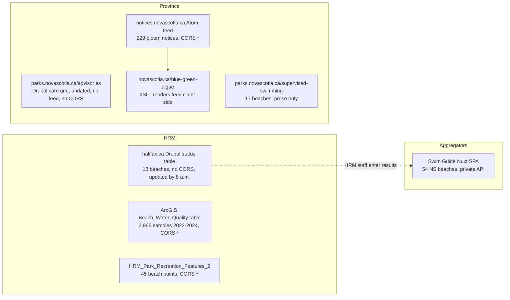

# Research: Halifax Beach Safety Advisory Map

**Date**: 2026-09-12T11:03:26-03:00
**Git Commit**: 410d251e838eb3006b076680e150e9527bbe8955
**Branch**: halifax-beach-safety-advisory-map-application-hk2d48
**Repository**: EduardKakosyan/volta_hackathon

## Research Question

1. **Existing frontend scaffold.** How is `volta-frontend/` built and composed today: build tooling, the `@` alias, how `main.tsx`, `App.tsx`, and `Layout.tsx` switch views, how pages consume `mockData.ts` and `types/index.ts`, and whether any data fetching, env usage, backend, or deployment config exists?
2. **Design system and visual conventions.** What tokens does `index.css` define (`@theme inline`, `:root` and `.dark` oklch values, `--radius`, `@custom-variant dark`), what fonts/shadows/spacing are in use, which shadcn/ui components exist and what variants they expose, and how pages use color, breakpoints, and the mobile `Sheet`?
3. **HRM supervised beach status data.** How is the halifax.ca status table structured, what is its status vocabulary and update schedule, how does it relate to the ArcGIS Beach Water Quality layer, where are algae notices published, what does the monitoring protocol PDF say, and what CORS/robots behaviour do these pages exhibit?
4. **Provincial advisories and blue-green algae reports.** How is parks.novascotia.ca/advisories structured, is there a feed or JSON endpoint, what does the supervised-swimming page list, how do the novascotia.ca algae pages render their bloom list, and what CORS/robots behaviour applies?
5. **Beach location and identity data.** Which public datasets provide names and coordinates for provincial park beaches, NSLS-supervised beaches, and HRM supervised beaches, and how do names differ across sources?
6. **Mapping library capabilities.** What do Apple MapKit JS, MapLibre GL JS, and CesiumJS offer for auth, map types, 3D/camera, annotations, overlays, clustering, free tiers, licensing, and React 19 + Vite loading?
7. **Existing comparable tools.** How does Swim Guide present NS beaches and where does its data come from, what is SolveHFX and how is it built, and what other services surface NS beach or algae advisories?

## Research Methodology (verbatim)

This document will remain objective and factual. It does not contain any recommendations or implementation suggestions.
Open questions will not ask Why things haven't been built or what should be built in the future.

There is no "implementation" section - that is intentional.

## Summary

The repository contains one deliverable: `volta-frontend/`, a Vite 7 + React 19 + TypeScript single-page app from a prior hackathon. It has no router, no data fetching, no environment variables, no backend, no tests, and no deployment config. A single `useState` string in `App.tsx` selects one of six page components, every one of which renders from hardcoded arrays in `src/data/mockData.ts`. The styling layer is stock shadcn/ui "new-york" with Tailwind v4 and a neutral (zero-chroma) oklch token set, so the primary color is near-black on white. Fifteen shadcn primitives exist, including `Sheet`, `Dialog`, `Tabs`, `Badge`, and `Card`. Page-level status colour is done with literal Tailwind palette classes and inline hex styles, not tokens. The `.dark` class is defined but never applied.

On the data side, HRM publishes live beach status exactly one way: a server-rendered Drupal table on halifax.ca with 18 beaches, a fixed status vocabulary of Open / Risk Advisory in Effect / Closed / Supervision ended for the season, and an explicit schedule of "updated weekdays by 8 a.m. and by 9 a.m. on weekends (between July 1 and August 31)". That page sends no CORS header. HRM's ArcGIS "Beach Water Quality" service is a geometry-less table of 2,966 historical lab samples (2022 to 2024) with open CORS. The province publishes park advisories as an undated, uncategorised Drupal card grid with no feed, but its blue-green algae bloom list is driven by a CORS-open Atom feed at notices.novascotia.ca with 229 entries back to 2022, each carrying lake, county, date, nearest community, and bloom type.

Beach coordinates are not on any of the status pages. They come from HRM's `HRM_Park_Recreation_Features_2` point layer (45 beach points), the NS Open Data park-entrances dataset (98 parks with points), GeoNOVA polygon layers for designated parks and Beaches Act beaches, and OpenStreetMap `natural=beach` features. Names differ across every source: the HRM table says "Cunard Pond Beach", the water-quality table says "Cunard Lake Beach", the recreation layer says "CUNARD JUNIOR HIGH SCHOOL PARK BEACH", and sample stations are "CUNARD A" through "CUNARD E".

For mapping, MapLibre GL JS 6.9 (BSD-3, ~276 KB gzipped) exposes pitch, bearing, raster-DEM terrain, fill-extrusion buildings, and globe projection with keyless basemaps from OpenFreeMap. Apple MapKit JS 6 requires a $99/yr developer membership, offers 250,000 map views per day, and supports rotation and camera altitude but has no tilt, terrain, or 3D buildings in the browser. CesiumJS is Apache 2.0 with a true 3D globe but depends on Cesium Ion for default terrain and imagery and needs Vite asset configuration. The only existing aggregator is Swim Guide, a Nuxt SPA fed directly by HRM for freshwater sites and by the RAH2050 citizen-science group for NSLS beaches, with no public API. SolveHFX is a Next.js/Vercel 311-reporting funnel, not a status map.

## Detailed Findings

### 1. The frontend scaffold is a static six-page SPA driven by one string of state

`volta-frontend/` is the standard Vite React-TS template with Tailwind v4 and shadcn/ui layered on. The build is `tsc -b && vite build`, and the only scripts are `dev`, `build`, `lint`, and `preview` (`volta-frontend/package.json:6-11`). Runtime dependencies are React 19.1, nine Radix primitives, `class-variance-authority`, `clsx`, `tailwind-merge`, `date-fns` 4, `lucide-react` 0.525, and `react-day-picker` 9 (`package.json:12-31`). Dev dependencies include Vite 7, TypeScript 5.8, ESLint 9 flat config, Tailwind 4.1 via `@tailwindcss/vite`, and `tw-animate-css` (`package.json:32-49`). No `tailwind.config.*` or `postcss.config.*` file exists; Tailwind is configured entirely through the Vite plugin and CSS.

The `@` alias is declared three times and must stay in sync: `resolve.alias` in `vite.config.ts:9-13`, `paths` in `tsconfig.json:7-12`, and again in `tsconfig.app.json:9-14`. `components.json:1-21` records shadcn settings: style `new-york`, `rsc: false`, `baseColor: "neutral"`, `cssVariables: true`, css at `src/index.css`, icon library `lucide`, and aliases for `@/components`, `@/components/ui`, `@/lib`, `@/lib/utils`, and `@/hooks` (the `hooks` directory does not exist).

```text
volta-frontend/
├── index.html                 # title/meta/JSON-LD for "Volta" at https://volta-app.com, <div id="root">
├── vite.config.ts             # react() + tailwindcss() plugins, "@" -> ./src
├── tsconfig.json              # project refs + "@/*" paths
├── tsconfig.app.json          # ES2022, bundler resolution, strict flags, include src
├── tsconfig.node.json         # type-checks vite.config.ts only
├── eslint.config.js           # js + ts-eslint + react-hooks + react-refresh
├── components.json            # shadcn new-york, neutral, lucide
├── public/
│   ├── robots.txt             # Allow: /, Sitemap: https://volta-app.com/sitemap.xml
│   └── sitemap.xml            # six volta-app.com URLs, lastmod 2025-07-01
└── src/
    ├── main.tsx               # createRoot + StrictMode, imports index.css
    ├── App.tsx                # useState('dashboard') + switch -> page component
    ├── App.css                # #root { height: 100vh }
    ├── index.css              # Tailwind import, @theme inline, :root/.dark tokens
    ├── lib/utils.ts           # cn() = twMerge(clsx())
    ├── types/index.ts         # User, Task, CalendarEvent, KnowledgeBaseFile, ChatMessage, DashboardStats
    ├── data/mockData.ts       # mockUser, mockTasks, mockCalendarEvents, mockKnowledgeBaseFiles, mockChatMessages, mockDashboardStats
    ├── components/
    │   ├── Layout.tsx         # sidebar (lg+), Sheet nav (<lg), header, <main>
    │   ├── Dashboard.tsx, Calendar.tsx, Tasks.tsx, Chat.tsx, KnowledgeBase.tsx, Settings.tsx
    │   └── ui/                # 15 shadcn primitives (see section 2)
    └── assets/react.svg       # unused template asset
```

Page switching is a plain string, not a route. `App.tsx:12` holds `const [currentPage, setCurrentPage] = useState('dashboard')`, `App.tsx:14-31` is a `switch` mapping `'dashboard' | 'calendar' | 'knowledge' | 'tasks' | 'chat' | 'settings'` to a component (default `Dashboard`), and `App.tsx:34` renders `<Layout currentPage onPageChange={setCurrentPage}>`. The URL never changes. No router package is installed.

```tsx
<StrictMode> (src/main.tsx)
  <App>                                   useState('dashboard')
    <Layout currentPage onPageChange>     useState(isMobileMenuOpen)
      <div hidden lg:flex lg:w-64>
        <Sidebar/>                        nav Buttons (variant default|ghost), Avatar, Badge "Beta"
      <Sheet> <SheetContent side="left" w-64> <Sidebar/>   (mobile)
      <header>  Menu trigger (lg:hidden), "Search knowledge base..." label, Bell + "3", Avatar
      <main flex-1 overflow-auto p-6>
        [Dashboard | Calendar | KnowledgeBase | Tasks | Chat | Settings]
```

`Layout.tsx:26-33` defines `navigationItems` with lucide icons; `Layout.tsx:38-95` is an inner `Sidebar` component rendered twice, once in the desktop column (`Layout.tsx:100-102`) and once inside `SheetContent` (`Layout.tsx:105-109`). The header's search label and bell badge are static (`Layout.tsx:114-152`).

Every page is a zero-prop function component reading directly from `@/data/mockData`. `Dashboard.tsx:15-24` derives upcoming tasks, upcoming events, and a completion rate from `mockDashboardStats`, `mockTasks`, and `mockCalendarEvents`. `Calendar.tsx:19-61` hand-builds a month grid (it does not use `ui/calendar.tsx`). `Tasks.tsx:27` is the only page that copies mock data into mutable state (`useState(mockTasks)`) so checkboxes toggle. `Chat.tsx:34-67` simulates an assistant reply with `setTimeout` and a canned `responses` array. `KnowledgeBase.tsx` and `Settings.tsx` are static forms; all "Save", "Create", "Upload", "Download", and "Delete" buttons have no handlers.

The data contracts are six interfaces in `src/types/index.ts:1-51`:

```ts
User            { id; name; email; avatar? }
Task            { id; title; description?; completed; priority: 'low'|'medium'|'high'; dueDate?; createdAt }
CalendarEvent   { id; title; description?; start; end; type: 'exam'|'assignment'|'study'|'meeting'|'other'; color? }
KnowledgeBaseFile { id; name; type; size; uploadedAt; tags: string[]; content? }
ChatMessage     { id; content; sender: 'user'|'assistant'; timestamp }
DashboardStats  { tasksCompleted; tasksTotal; upcomingEvents; filesUploaded; studyHoursWeek }
```

`mockData.ts:1-193` exports one const per type, with dates in June/July 2025 and five hex colours on events (`#ef4444`, `#f59e0b`, `#3b82f6`, `#10b981`, `#8b5cf6` at `mockData.ts:66,75,84,93,102`).

There is no data layer beyond this. A grep of `src/` for `fetch(`, `axios`, `import.meta.env`, `process.env`, and `VITE_` returns nothing. The only `useEffect` in the app scrolls a ref (`Chat.tsx:30-32`). No `.env*` file, Dockerfile, `.github/`, `vercel.json`, or `netlify.toml` exists anywhere in the repo. `public/sitemap.xml:1-39` and `public/robots.txt:1-8` reference `https://volta-app.com`, and `index.html:8-76` carries Open Graph, Twitter, and JSON-LD metadata for that domain, but no deploy target is configured. The root `README.md` describes an n8n + Pinecone agent backend and links five PNG screenshots under `images/`; no n8n workflow JSON or Pinecone code is in the tree.

The working tree has one uncommitted change: the root `.gitignore` gains two identical `.humanlayer/tasks/` blocks and a trailing newline (visible in `git diff .gitignore`).

#### Testing patterns

There are no tests. No `*.test.*` or `*.spec.*` files, no `vitest`, `jest`, or `playwright` config, no test runner in `devDependencies`, and no `test` script in `package.json`.

### 2. The design system is stock shadcn neutral tokens; page colour is hardcoded palette classes and inline hex

`src/index.css` is the entire theme. Lines 1 to 4 import Tailwind and `tw-animate-css` and declare `@custom-variant dark (&:is(.dark *))`, so dark mode is class-based, not media-query based. The `@theme inline` block (`index.css:6-42`) maps every `--color-*` Tailwind token to a CSS variable and defines the radius scale from a single base: `--radius: 0.625rem` (10px), with `sm` = 6px, `md` = 8px, `lg` = 10px, `xl` = 14px (`index.css:45`).

The `:root` set (`index.css:44-77`) is near-grayscale. Only `--destructive` and the five chart tokens carry chroma:

| Token | Light (`:root`) | Dark (`.dark`) |
|---|---|---|
| `--background` | `oklch(1 0 0)` | `oklch(0.145 0 0)` |
| `--foreground` | `oklch(0.145 0 0)` | `oklch(0.985 0 0)` |
| `--card` / `--popover` | `oklch(1 0 0)` | `oklch(0.205 0 0)` |
| `--primary` | `oklch(0.205 0 0)` | `oklch(0.922 0 0)` |
| `--primary-foreground` | `oklch(0.985 0 0)` | `oklch(0.205 0 0)` |
| `--secondary` / `--muted` / `--accent` | `oklch(0.97 0 0)` | `oklch(0.269 0 0)` |
| `--muted-foreground` | `oklch(0.556 0 0)` | `oklch(0.708 0 0)` |
| `--destructive` | `oklch(0.577 0.245 27.325)` | `oklch(0.704 0.191 22.216)` |
| `--border` / `--input` | `oklch(0.922 0 0)` | `oklch(1 0 0 / 10%)` / `oklch(1 0 0 / 15%)` |
| `--ring` | `oklch(0.708 0 0)` | `oklch(0.556 0 0)` |
| `--chart-1` | `oklch(0.646 0.222 41.116)` | `oklch(0.488 0.243 264.376)` |
| `--chart-2` | `oklch(0.6 0.118 184.704)` | `oklch(0.696 0.17 162.48)` |
| `--chart-3` | `oklch(0.398 0.07 227.392)` | `oklch(0.769 0.188 70.08)` |
| `--chart-4` | `oklch(0.828 0.189 84.429)` | `oklch(0.627 0.265 303.9)` |
| `--chart-5` | `oklch(0.769 0.188 70.08)` | `oklch(0.645 0.246 16.439)` |
| `--sidebar` | `oklch(0.985 0 0)` | `oklch(0.205 0 0)` |
| `--sidebar-primary` | `oklch(0.205 0 0)` | `oklch(0.488 0.243 264.376)` |
| `--sidebar-accent` | `oklch(0.97 0 0)` | `oklch(0.269 0 0)` |
| `--sidebar-border` | `oklch(0.922 0 0)` | `oklch(1 0 0 / 10%)` |
| `--sidebar-ring` | `oklch(0.708 0 0)` | `oklch(0.556 0 0)` |

The `@layer base` block (`index.css:113-120`) applies `border-border outline-ring/50` to `*` and `bg-background text-foreground` to `body`. No `font-family`, `box-shadow`, `@keyframes`, or spacing token is declared anywhere in `index.css` or `App.css`; Tailwind defaults apply. Animations in `dialog`, `sheet`, `select`, and `dropdown-menu` come from `tw-animate-css` utility classes.

Fifteen shadcn primitives exist under `src/components/ui/`:

| File | Wraps | Exports | Variants |
|---|---|---|---|
| `button.tsx` | `<button>` / `Slot` | `Button`, `buttonVariants` | variant: default, destructive, outline, secondary, ghost, link. size: default (h-9), sm (h-8), lg (h-10), icon (size-9) |
| `badge.tsx` | `<span>` / `Slot` | `Badge`, `badgeVariants` | variant: default, secondary, destructive, outline. No size variant |
| `card.tsx` | `<div>` | `Card`, `CardHeader`, `CardFooter`, `CardTitle`, `CardAction`, `CardDescription`, `CardContent` | `rounded-xl border py-6 shadow-sm gap-6` |
| `sheet.tsx` | `@radix-ui/react-dialog` | `Sheet`, `SheetTrigger`, `SheetClose`, `SheetContent`, `SheetHeader`, `SheetFooter`, `SheetTitle`, `SheetDescription` | side: right (default), left, top, bottom; left/right are `w-3/4 sm:max-w-sm` |
| `dialog.tsx` | `@radix-ui/react-dialog` | `Dialog`, `DialogTrigger`, `DialogContent`, `DialogHeader`, `DialogFooter`, `DialogTitle`, `DialogDescription`, `DialogClose`, `DialogOverlay`, `DialogPortal` | centered, `sm:max-w-lg`, `showCloseButton` default true |
| `tabs.tsx` | `@radix-ui/react-tabs` | `Tabs`, `TabsList`, `TabsTrigger`, `TabsContent` | `TabsList` is `bg-muted h-9 rounded-lg p-[3px]` |
| `select.tsx` | `@radix-ui/react-select` | `Select`, `SelectTrigger`, `SelectValue`, `SelectContent`, `SelectItem`, `SelectGroup`, `SelectLabel`, `SelectSeparator`, scroll buttons | trigger size: default (h-9), sm (h-8) |
| `switch.tsx` | `@radix-ui/react-switch` | `Switch` | `h-[1.15rem] w-8` |
| `progress.tsx` | `@radix-ui/react-progress` | `Progress` | `h-2 rounded-full`, indicator via inline translateX |
| `dropdown-menu.tsx` | `@radix-ui/react-dropdown-menu` | 15 exports incl. `DropdownMenuItem` (variant default/destructive) | |
| `checkbox.tsx`, `avatar.tsx`, `input.tsx`, `textarea.tsx` | Radix / native | one export each (plus `AvatarImage`, `AvatarFallback`) | |
| `calendar.tsx` | `react-day-picker` | `Calendar`, `CalendarDayButton` | unused by any page |

Status colour in pages bypasses the token system. Priority maps to Badge variants (`Tasks.tsx:47-54`: high → destructive, medium → default, low → secondary; `Dashboard.tsx:115-118` inlines the same ternary). Beyond that, colour is literal Tailwind palette classes with no `dark:` counterpart: `bg-red-500` on the bell badge (`Layout.tsx:140`), `text-red-600` / `text-orange-600` for overdue and due-soon (`Tasks.tsx:106,120`), and `text-green-600`, `text-blue-600`, `text-red-600`, `text-orange-600` on stat icons (`Tasks.tsx:147-183`). Event hex colours are consumed only through inline `style` (`Dashboard.tsx:158-162` sets `borderColor`/`color`; `Calendar.tsx:183-190` sets `backgroundColor`). No page component uses a `dark:` class; the "Dark Mode" `Switch` in `Settings.tsx:171` has no `checked` or `onCheckedChange` prop, and nothing ever adds `.dark` to the document.

Responsive conventions use `sm:`, `md:`, and `lg:` only (no `xl:`). The sidebar is hidden below `lg` and 256px wide at `lg+` (`Layout.tsx:100`); the mobile `Sheet` is also `w-64` (`Layout.tsx:107`). Stat grids go 1 → 2 → 4 columns (`Dashboard.tsx:37`) or 1 → 4 (`Tasks.tsx:143`), and search rows stack below `sm` (`Tasks.tsx:194`, `KnowledgeBase.tsx:83`). The shell is `flex h-screen bg-background` (`Layout.tsx:98`) with `<main className="flex-1 overflow-auto p-6">` and no max-width.

#### Testing patterns

None. No UI component or page has a test; see section 1.

### 3. HRM publishes live status as one server-rendered Drupal table, updated by 8 a.m.; the ArcGIS table is historical lab data

The status page at https://www.halifax.ca/parks-recreation/programs-activities/swimming/supervised-beaches-outdoor-pools-splash-pads is fully server-rendered Drupal (headers `x-drupal-cache: HIT`, served through Azure Front Door). A plain `curl` with a browser user agent returns the complete populated table; one automated fetcher received a 403, so the site does user-agent filtering but does not present a JS challenge. The response carries no `Access-Control-Allow-Origin` header, so a browser on another origin cannot fetch it directly. `robots.txt` disallows only Drupal system paths and does not block beach pages.

The page states its own cadence verbatim: "Beach status in 2026 is updated weekdays by 8 a.m. and by 9 a.m. on weekends (between July 1 and August 31). Please note that beach closures due to suspected blue-green algae can happen at any time. This page will be updated as needed regarding blue-green algae-related closures." The `og:updated_time` meta was `2026-09-08T16:21:29-03:00` at research time.

The table is `<table id="tablefield-paragraph-35121-field_table-0" class="tablefield c-table" data-title="Supervised beach status updates">` with six columns. Its header row literally encodes the status vocabulary:

```text
Beach Name | Location | Lifeguard Supervision | Water Type | Water Sample Results | Beach Status (Open/Risk Advisory in Effect/Closed)
```

All 18 rows (observed 2026-09-12, off-season):

| Beach Name | Location | Lifeguard Supervision | Water Type | Sub-page slug |
|---|---|---|---|---|
| Albro Lake Beach | Albro Lake, Dartmouth | July 1 - August 31 | Fresh water | `.../albro` |
| Birch Cove Beach | Lake Banook, Dartmouth | July 1 - September 1 | Fresh water | `.../birch` |
| Campbell Point Beach | Hatchet Lake, Halifax | July 1 - September 1 | Fresh water | `.../campbell` |
| Chocolate Lake Beach | Chocolate Lake, Halifax | July 1 - September 1 | Fresh water | `supervised-beaches-outdoor-pools-splash-pads-0` |
| Cunard Pond Beach | Williams Lake, Halifax | July 1 - September 1 | Fresh water | `.../cunard` |
| Kearney Lake Beach | Kearney Lake, Halifax | July 1 - September 1 | Fresh water | `.../kearney` |
| Kidston Lake Beach | Kidston Lake, Halifax | July 1 - August 31 | Fresh water | `.../kidston` |
| Kinap Beach | Porters Lake | July 1 - August 31 | Salt water (brackish) | `.../kinap` |
| Lake Echo Beach | Lake Echo | July 1 - August 31 | Fresh water | `.../lake` |
| Long Pond Beach | Long Pond, Halifax | July 1 - August 31 | Fresh water | `.../long` |
| Oakfield Park Beach | Shubenacadie Grand Lake, Oakfield | July 1 - September 1 | Fresh water | `.../oakfield` |
| Penhorn Lake Beach | Penhorn Lake, Dartmouth | July 1 - September 1 | Fresh water | `.../penhorn` |
| Pleasant Drive Beach | Petpeswick Lake, Eastern Shore | July 1 - September 1 | Fresh water | `.../pleasant` |
| Sandy Lake Beach | Sandy Lake, Bedford | July 1 - September 1 | Fresh water | `.../sandy` |
| Saunders Beach | Paper Mill Lake (dam side), Bedford | July 1 - September 1 | Fresh water | no link |
| Shubie Park Beach | Lake Charles, Shubie Park, Dartmouth | July 1 - September 1 | Fresh water | `.../shubie` |
| Springfield Beach | Springfield Lake, Sackville | July 1 - August 31 | Fresh water | no link |
| Taylor Head Beach | Atlantic Ocean | July 1 - August 31 | Salt water | no link |

Every row currently shows `Water Sample Results = N/A` and `Beach Status = Supervision ended for the season`, which is the fourth, out-of-season value. Saunders Beach, Springfield Beach, and Taylor Head Beach have no anchor in the table, no entry in the site navigation, and no page at any obvious slug (`/saunders`, `/springfield`, `/taylor`, `/taylor-head` all return 404), so 15 of the 18 beaches have a sub-page. Sub-pages (base path `/parks-recreation/programs-activities/swimming/supervised-beaches-outdoor-pools-splash-pads/`) contain no table; they are fixed headings (Location, Weather, Lifeguards Supervision, Parent and Guardian Supervision, Safety, Accessibility, Water Testing, Equipment Lending, Swimming Lessons). For example the Kinap page states lifeguards are on duty "July 1 to August 31 from 11:00 a.m. to 6:00 p.m on fair weather days only", and Chocolate Lake adds an extended season September 4 to 6.

A second table on the same page reproduces Health Canada's limits, and the 2026 monitoring protocol PDF (https://www.halifax.ca/sites/default/files/documents/about-the-city/energy-environment/finalhalifaxbeachwaterqualitymonitoringprotocol2026.pdf) matches it exactly:

| Water type | Indicator | Geomean of 5 samples | Single sample |
|---|---|---|---|
| Fresh water | E. coli | 126 / 100 mL | 235 / 100 mL |
| Salt water (brackish) | Enterococci | 35 / 100 mL | 70 / 100 mL |

The protocol describes the operating process. Five samples are collected **weekly** at each beach at fixed stations A through E across the beach face at knee depth. Samples must reach the lab (BV Labs) so analysis begins within 24 hours; E. coli results return next day at noon and enterococci in two days. Since 2024 HRM issues a **water quality advisory** rather than a closure when bacteria exceed the limits: lifeguards stay on site but do not supervise swimming, signage is posted, and lessons are cancelled. New for 2026, a rain gauge trigger issues an advisory automatically when rainfall exceeds 25 mm at lakes with piped stormwater. The advisory lifts when the geomean of five samples is back under the limit. Cyanobacteria are handled by visual observation, not routine sampling: a suspected bloom or mat closes the beach immediately, then a three-step cycle runs (taxonomic identification by Bio-Limno within 48 h; microcystin toxin analysis by Harris Industrial, Health Canada limit 10 µg/L; on-site test-strip confirmation) until toxins are confirmed below the limit. HRM issues closure notices only for its 18 supervised beaches plus Shubie Park Dog Beach; everything else is provincial jurisdiction. The Water Resources Specialist holds authority to issue and lift closures.

```text
weekly sampling at stations A..E
  -> lab result within 24-48 h
  -> if geomean > limit OR single > limit OR rainfall > 25 mm
       post "Risk Advisory in Effect" on the Drupal table (by 8 a.m. weekdays / 9 a.m. weekends)
       resample same/next weekday; lift when geomean <= limit
  -> if bloom/mat observed (lifeguard, 311, or NSECC report)
       post "Closed" immediately; run identification -> toxin test -> strip confirmation until clear
```

The harmful algae page (https://www.halifax.ca/about-halifax/environment-climate-change/lakes-rivers/harmful-algae-blooms) is a long FAQ, not a list of current blooms. Its "Alerts and closures" section defers to halifax.ca/beaches for live status and to novascotia.ca/blue-green-algae for provincial notices. It states staff monitor "19 beaches", versus the 18-row table.

HRM's open data is a separate, historical artefact. The ArcGIS service `https://services2.arcgis.com/11XBiaBYA9Ep0yNJ/arcgis/rest/services/Beach_Water_Quality/FeatureServer` has `"layers": []` and one item under `"tables"`: id 1, type `Table`. There is no `geometryType`, so it carries no coordinates, and `/FeatureServer/0` returns a 400 "layer not found". It answers every request with `access-control-allow-origin: *`, so a browser can query it directly. Total count is 2,966 records; `SAMPLING_DATE` runs from 2022-06-23 to 2024-08-28 (via `outStatistics` min/max), so no 2025 or 2026 samples are present even though the layer's `dataLastEditDate` is 2025-12-03.

```text
Beach_Water_Quality/FeatureServer/1 (Table, displayField BEACH_NAME)
  OBJECTID                    OID
  ASSET_ID                    String(20)   mostly null
  BEACH_NAME                  String(100)  20 distinct names; null for Non Supervised stations
  SAMPLING_DATE               DateOnly
  BEACH_SAMPLE_NAME           String(100)  station, e.g. "KINAP A", "SANDY POINT ROCK A" (~118 distinct)
  REPORTABLE_DETECTION_LIMIT  Integer
  REPORT_VALUE                String(40)   raw lab result, e.g. "37"
  PARAMETER                   String(100)  "Enterococci" | "Escherichia coli"
  UNITS                       String(20)   "CFU/100mL"
  CATEGORY_TYPE               String(20)   "Supervised" | "Non Supervised"
  YEAR                        Integer      2022..2024
  GEOMETRIC_MEAN_VALUE        Double       geomean of the 5-station set for that beach/date
  INDIVIDUAL_THRESHOLD        String(10)   "235/100 ml" | "70/100 ml"
  GEOMETRIC_THRESHOLD         String(10)   "126/100 ml" | "35/100 ml"
  BEACH_CLOSURE_FLAG          Integer      0 | 1
```

The 20 distinct `BEACH_NAME` values with `CATEGORY_TYPE = 'Supervised'` are: Albro Lake Beach, Birch Cove Beach, Campbell Point Beach, Chocolate Lake Beach, Cunard Lake Beach, Fenerty Beach, Kearney Lake Beach, Kidston Lake Beach, Kinap Beach, Lake Echo Beach, Long Pond Beach, Malay Falls Beach, Penhorn Lake Beach, Petpeswick Lake Park Beach/Pleasant Drive Beach, Sandy Lake Beach, Saunders Beach, Shubie Park Beach, Springfield Beach, Taylor Head Provincal Beach (sic), Webber's Beach. Fenerty, Malay Falls, and Webber's appear here but not in the 2026 web table; Oakfield Park Beach appears in the table but not in the 2022 to 2024 data. Non-supervised rows are the `SANDY POINT ROCK A-E` and `SANDY POINT SAND A-E` stations. The Hub item (owner `opendata_HRM`, id `68567ac8da7f49eea4af051d23ce18d7`) is licensed under the HRM Open Data Licence and its description states that "Testing occurs from July 1 to August 31 yearly" and that historical data "is not necessarily reflective of present conditions."

HRM's Hub contains no dedicated supervised-beach or lifeguard layer; the only encoding of supervision in ArcGIS is `CATEGORY_TYPE` above and a `SUPERVISED` Y/N field on the recreation features layer described in section 5.

#### Testing patterns

Not applicable; these are external systems. No code in the repo touches them.

### 4. Provincial park advisories are an undated Drupal card grid with no feed; the algae bloom list is a CORS-open Atom feed

`parks.novascotia.ca` is Drupal 10 (meta `Generator`), fronted by an F5 BIG-IP (a `TS...` cookie) that did not challenge or block plain `curl`. It sends no `Access-Control-Allow-Origin` header. `robots.txt` blocks only Drupal system paths.

The advisories page is a Drupal View named `all_advisories` (display `page_1`) rendering a Bootstrap grid of `col-sm-12 col-md-4 views-row` cards, fully present in the initial HTML. Each card is one anchor:

```html
<a href="/potential-blue-green-algae-grand-lake">
  <div class="advisory-teaser-wrapper card">
    <div class="advisory-teaser-content card-body">
      <strong><span class="field field--name-title ...">Potential Blue-green Algae Grand Lake</span></strong>
      <div class="... field--name-body ..."><p>There has been a report of blue-green algae at the following location: Shubenacadie Grand Lake, HRM...</p></div>
```

The listing shows **title and body excerpt only**. There is no date, no park reference field, no category taxonomy, no filter form, and no pager (14 items at research time). Beach closures, blue-green algae notices, boil-water notices, trail closures, and construction notices are interleaved with no distinguishing field beyond the title text. Detail URLs are root-level slugs (not `/advisories/<slug>`), e.g. `/graves-island-closed-causeway-construction` or `/do-not-consume-water-advisory-islands-provincial-park-0`; a `-0` suffix marks a re-published alias. The detail page is node type `advisory` and adds nothing except the untruncated body. The legacy `/content/current-advisories` path now 301s to a 403 page.

No machine-readable channel exists for advisories. There is no `<link rel="alternate" type="application/rss+xml">`; `/advisories/rss`, `/advisories/feed`, `/jsonapi`, and `/jsonapi/node/advisory` all 404. `/rss.xml` is Drupal's front-page feed containing one 2020 item. `/sitemap.xml` contains a single URL pointing at a staging host (`template8i2.redskydev.ca`).

The supervised-swimming page (`/supervised-swimming`, node type `band-page`) is prose plus links. It states "Lifeguard supervision will take place from July 1 - August 30, 2026", "Lifeguards are on duty from 10 am - 6 pm daily except for at Clam Harbour and Mavillette Beach where supervision is provided on weekends only", that Lawrencetown is supervised on Labour Day weekend September 5 to 7 and September 12 to 13, that supervision is provided by the Nova Scotia Lifeguard Service, and that "Water quality is only monitored at supervised beaches." It links 17 park pages at `/park/<slug>`: Bayfield Beach, Bayswater Beach, Clam Harbour Beach, Dollar Lake, Dominion Beach, Ellenwood Lake, Heather Beach, Lawrencetown Beach, Martinique Beach, Mavillette Beach, Melmerby Beach, Point Michaud Beach, Pomquet Beach, Port Maitland Beach, Queensland Beach, Rainbow Haven Beach, Rissers Beach. Park pages (checked: `/park/rissers-beach`) have no schema.org geo markup, no lat/long, and no map embed; the only location data is a street address in the meta description and a PDF trail map.

The province's beach-monitoring explainer at https://www.novascotia.ca/beaches-monitoring-and-sampling states that "Not all beaches in Nova Scotia are tested", that the Lifesaving Society provides bacteriological sampling at provincially supervised beaches, that HRM runs its own program, and that E. coli (fresh) or enterococci (salt) above national guidelines triggers an advisory that stays until sampling confirms levels are back under. No sampling frequency or results dataset is published for the provincial program.

The blue-green algae list is the one structured provincial source. `https://novascotia.ca/dhw/environmental/blue-green-algae.asp` 302-redirects twice to `https://novascotia.ca/blue-green-algae/`. That page's raw HTML has an empty placeholder:

```html
<div id="reported-algae">
  <h2>Blue-green algae reported in 2026</h2>
  <div data-transform="https://notices.novascotia.ca/feeds/blue-green-algae.atom"
       data-transformer="./reports.xslt"
       data-transform-params="year=2026&lang=en"></div>
```

A province-wide script (`https://novascotia.ca/clf/scripts/xmld.js`) fetches the Atom feed in the browser and applies `reports.xslt`, which filters entries to the requested year and renders a `<table class="table table-responsive">` with five columns: Body of water, Nearest community, County, Reported (rendered as "Month YYYY" only), Bloom type, plus a "Last updated" line from the feed's `<updated>`. The page hardcodes `year=2026`; other years exist only in the feed.

The feed itself, `https://notices.novascotia.ca/feeds/blue-green-algae.atom`, returns `Content-Type: application/atom+xml`, `generator: drupal-blue-green-algae-to-atom.xslt`, and **`Access-Control-Allow-Origin: *`**. It had 229 entries spanning 2022 to 2026 at research time. Each entry:

```xml
<entry>
  <id>https://notices.novascotia.ca/node/8656</id>
  <title>Crooked Lake, Bagnells Lake, Framboise River</title>
  <published>2026-09-03T14:36:28-03:00</published>
  <category scheme="...#county" term="county-27" label="Richmond"/>
  <content type="application/xml">
    <notice xmlns="https://notices.novascotia.ca/xmlns/blue-green-algae-report">
      <lake xml:lang="en">Crooked Lake, Bagnells Lake, Framboise River</lake>
      <county>Richmond</county>
      <date>2026-09-03</date>
      <location-details>Framboise</location-details>
      <bloom-details>Mat</bloom-details>
    </notice>
  </content>
</entry>
```

`bloom-details` is free text with inconsistent casing (`Mat`, `bloom`, `Bloom`). Entries carry no coordinates. Counties seen include Halifax, Hants, Lunenburg, Kings, Annapolis, Colchester, Cumberland, Pictou, Antigonish, Guysborough, Richmond, Cape Breton, Inverness, Digby, Yarmouth, Shelburne, and Queens. No blue-green algae or park-advisory dataset exists on `data.novascotia.ca`; searches there return only county water-quality sensor datasets. `novascotia.ca` itself sends no CORS header and its `robots.txt` blocks only unrelated legacy paths.



#### Testing patterns

Not applicable; external systems.

### 5. Coordinates live in four geodata sources, and every source spells beach names differently

None of the status pages in sections 3 and 4 carry coordinates. Five machine-readable sources do:

| Source | Endpoint | Geometry | Beach coverage | Extra attributes |
|---|---|---|---|---|
| HRM Park Recreation Features | `https://services2.arcgis.com/11XBiaBYA9Ep0yNJ/arcgis/rest/services/HRM_Park_Recreation_Features_2/FeatureServer/0` | Point (SR 3857; pass `outSR=4326`) | 45 features where `MAINRECUSE LIKE '%Beach%'` | `REC_NAME`, `MAINRECUSE`, `SUPERVISED` (Y/N), `REC_TYPE`, `REC_ID` |
| NS Open Data park entrances | `https://data.novascotia.ca/resource/c6mf-qy4u.json` (Socrata) | Point (`the_geom`) | 98 provincial parks; beach parks identifiable by "Beach" in `name_full` | `park_type` = Day Use / Camping |
| NS Open Data Lifeguard Beach Counts | `https://data.novascotia.ca/resource/ak4w-ymqm.json` | none | 20 provincial beach names, 2000 to 2023 | `year`, `beach`, `count` |
| GeoNOVA land-use MapServer | `https://fletcher.novascotia.ca/arcgis/rest/services/mrlu/restricted_conditional_limited_land_use/MapServer` layer 4 "Protected Beaches" (93 polygons) and layer 8 "Designated Provincial Parks" (98 polygons) | Polygon | Beaches Act boundaries and park boundaries | `NAME` only |
| OpenStreetMap via Overpass | `https://overpass-api.de/api/interpreter` | node/way, `out center` | dozens of `natural=beach` with `name` | `lifeguard`, `supervised`, `sport=swimming`, `surface` on some |

The HRM recreation layer is the densest source for HRM beaches. Sample points (WGS84):

| `REC_NAME` | Lon | Lat | `SUPERVISED` |
|---|---|---|---|
| CHOCOLATE LAKE PARK BEACH | -63.6218 | 44.6379 | N |
| KINAP CANOE CLUB BEACH | -63.3066 | 44.6800 | N |
| DINGLE BEACH | -63.5955 | 44.6292 | N |
| KEARNEY LAKE BEACH | -63.6847 | 44.6877 | N |
| LAKE BANOOK LION'S BEACH | -63.5612 | 44.6752 | N |
| LONG POND BEACH | -63.5753 | 44.5759 | N |
| PENHORN LAKE PARK BEACH | -63.5397 | 44.6754 | N |
| SPRINGFIELD LAKE RECREATION PARK PARK BEACH | -63.7364 | 44.8198 | N |
| CAMPBELL POINT PARK BEACH | -63.7224 | 44.5589 | Y |
| WEBBER'S BEACH | -62.9499 | 44.7705 | Y |
| RAINBOW HAVEN BEACH | -63.4157 | 44.6485 | N |
| QUEENSLAND BEACH | -64.0280 | 44.6349 | N |
| CRYSTAL CRESCENT BEACH | -63.6196 | 44.4597 | N |
| TAYLOR HEAD PROVINCAL PARK BEACH | -62.5608 | 44.8086 | N |

Only two of the 45 points carry `SUPERVISED = 'Y'`, so that flag tracks something narrower than the 18-beach lifeguard roster. The Socrata park-entrances rows look like `{"name_full":"Bayfield Beach Provincial Park","park_type":"Day Use","the_geom":{"type":"Point","coordinates":[-61.7588473,45.6395358]}}`. GeoNOVA layers expose `NAME` and polygon rings only; a centroid must be computed client-side (Rissers Beach Provincial Park averages to roughly 44.2307, -64.4285). The Socrata catalog (`https://api.us.socrata.com/api/catalog/v1?domains=data.novascotia.ca&q=beach`) lists nothing else with coordinates. open.canada.ca mirrors only the Lifeguard Beach Counts dataset. The province's public parks map is an ArcGIS Experience Builder app at `https://experience.arcgis.com/experience/87a91c432fe7403e8f3ca4bc7631b9b6/`.

An Overpass query that returned results against the HRM bounding box:

```text
[out:json][timeout:50];
(
  node["natural"="beach"]["name"](44.4,-63.95,44.85,-63.0);
  way["natural"="beach"]["name"](44.4,-63.95,44.85,-63.0);
);
out center tags;
```

It returned, among others, Kearney Lake Beach (44.6876, -63.6847, `lifeguard=yes supervised=yes`), Springfield Lake Beach, Albro Lake Beach, Campbell Point Park Beach, Rainbow Haven Beach, Lawrencetown Beach (44.6441, -63.3353), Long Pond Beach, Kinap Beach, Shubie Beach, Crystal Crescent Nude Beach, and Black Rock Beach. That box did not return Clam Harbour, Martinique, Dingle, or Lake Banook by name.

The provincially supervised roster differs by source. `parks.novascotia.ca/supervised-swimming` lists 17 for 2026 (section 4). The NSLS page `https://nsls.lifesavingns.ca/nsls/beaches` lists 24 by region: Cape Breton (Ingonish, Dominion, Mira Gut, Point Michaud, Port Hood, Inverness), North Shore (Pomquet, Bayfield, Melmerby, Heather), Central (Aylesford Lake, Queensland, Bayswater, Rissers, Dollar Lake), Eastern (Clam Harbour, Martinique, Rainbow Haven), Southwest (Stoney Island, Lake Ellenwood, Lake Milo, Mavillette, Port Maitland). Ingonish, Aylesford Lake, Lake Milo, and Stoney Island appear only on the NSLS page; Inverness, Mira Gut, and Port Hood appear on NSLS and in the historical Socrata counts but not on the 2026 parks page; Lawrencetown appears on the parks page but not the NSLS list. The `ns.211.ca` list returned only a bot-verification placeholder.

Names for the same HRM beach across sources:

| HRM status table | Beach Water Quality `BEACH_NAME` | Sample stations | Recreation layer `REC_NAME` | OSM `name` |
|---|---|---|---|---|
| Chocolate Lake Beach | Chocolate Lake Beach | CHOCOLATE A-E | CHOCOLATE LAKE PARK BEACH | (not returned) |
| Kinap Beach | Kinap Beach | KINAP A-E | KINAP CANOE CLUB BEACH | Kinap Beach |
| Cunard Pond Beach | Cunard Lake Beach | CUNARD A-E | CUNARD JUNIOR HIGH SCHOOL PARK BEACH | (not returned) |
| Birch Cove Beach | Birch Cove Beach | BIRCH COVE A-E | BIRCH COVE PARK BEACH | (not returned) |
| Springfield Beach | Springfield Beach | SPRINGFIELD A-E | SPRINGFIELD LAKE RECREATION PARK PARK BEACH | Springfield Lake Beach |
| Pleasant Drive Beach | Petpeswick Lake Park Beach/Pleasant Drive Beach | PLEASANT A-E | PETPESWICK LAKE PARK BEACH | West Petpeswick Beach (different point) |
| Saunders Beach | Saunders Beach | SAUNDERS A-E | SCOTT SAUNDERS MEMORIAL PARK BEACH | (not returned) |
| Taylor Head Beach | Taylor Head Provincal Beach | TAYLOR HEAD A-E | TAYLOR HEAD PROVINCAL PARK BEACH | — |
| Lake Echo Beach | Lake Echo Beach | LAKE ECHO A-E, LAKE ECHO C (1)/(2) | LAKE ECHO COMMUNITY CENTRE BEACH | (not returned) |
| Shubie Park Beach | Shubie Park Beach | SHUBIE A-E | SHUBIE PARK BEACH / SHUBIE PARK CAMPSITE BEACH | Shubie Beach |
| Oakfield Park Beach | (absent) | OAKFILED C (typo) | — | — |
| (absent) | Webber's Beach | WEBBERS A-E | WEBBER'S BEACH | (not returned) |
| (absent) | Fenerty Beach, Malay Falls Beach | — | FENERTY BEACH, MALAY FALLS BEACH | (not returned) |

Station names also contain typos (`OAKFILED C`, `PEHHORN A/B/C`). Dingle Beach and Lake Banook exist as recreation-layer points but not in the HRM status table or water-quality table; Birch Cove Beach is the supervised beach on Lake Banook. Swim Guide's records carry their own coordinates (Chocolate Lake at 44.637987, -63.621837) and their own ids (`/beach/5512`).

#### Testing patterns

Not applicable; external systems.

### 6. MapLibre exposes tilt, terrain, and globe with no key; MapKit JS is rotate-and-altitude only; Cesium is a full globe with heavy setup

**Apple MapKit JS** is at version 6.0 (a rewrite; the v5 line ended at 5.81). It loads either by script tag (`https://cdn.apple-mapkit.com/mk/6/mapkit.core.js` with `data-libraries="map,annotations,overlays"` and `data-callback`; the legacy full `mapkit.js` bundle is documented as not recommended for production) or via Apple's official npm loader `@apple/mapkit-loader` (MIT, v0.2.1), which returns a promise resolving to the `mapkit` namespace. Official types ship as `@types/apple-mapkit` (maintained by Apple since 5.80); the older community `@types/apple-mapkit-js` still exists. The community React wrapper is `mapkit-react` (MIT, v1.16.1). Apple Developer Program membership is required at $99 USD/year.

Two authentication paths are documented. A **dashboard-issued Maps token** (since 5.78.1) is created under Services → Maps → Tokens with a Token Type (MapKit JS, Embed API, Server API, Web Snapshots), a Restriction Type (Domain or None), and, for Domain, a validation duration of 30/90/180 days, a custom date, or **No Expiration**. That token is embeddable client-side. The **Maps ID + private key** path creates a `maps.`-prefixed identifier and a one-time-download `.p8` key, then signs a JWT with header `alg: ES256`, `kid`, `typ: JWT` and claims `iss` (Team ID), `iat`, `exp`, `scope` (`mapkit_js`, `server_api`, `embed_api`, `web_snapshots`), and `origin` (required when scope includes `mapkit_js`). Apple's guidance is explicit: "don't put your private key in public facing client-side code", so this path requires a server (`mapkit.init({ authorizationCallback })` fetches the token). Forum reports put a practical ceiling of roughly six months on `exp`; Apple's docs do not state a number. The free tier is stated verbatim on developer.apple.com/maps/web/: "a free daily limit of 250,000 map views and 25,000 service calls per Apple Developer Program membership."

Map types are `mapkit.MapType.Standard`, `Satellite`, `Hybrid`, and `MutedStandard`. The camera API on `mapkit.Map` consists of `cameraDistance`, `cameraZoomRange` (`CameraZoomRange` with `minCameraDistance`/`maxCameraDistance`), `rotation`, `isRotationEnabled`, `isRotationAvailable` (false without WebGL), and animated setters. **There is no `tilt` or `pitch` property**, no 3D building extrusion, no flyover, and no terrain relief in the browser; the only street-level 3D feature is `LookAround` / `LookAroundPreview` (since 5.79). Annotations are `MarkerAnnotation`, `ImageAnnotation`, and custom `Annotation`, all clusterable via `clusteringIdentifier` with `map.annotationForCluster` for custom cluster rendering. Overlays are `CircleOverlay`, `PolylineOverlay`, `PolygonOverlay`, and `TileOverlay` (in v6 its `urlTemplate` became `imageForTile` and it no longer disables rotation).

**MapLibre GL JS** is at 6.9.0, BSD-3-Clause, ESM-only in v6, roughly 276 KB gzipped per Bundlephobia. Camera `pitch` and `bearing` are first-class map options. Terrain is `map.setTerrain({ source, exaggeration })` over a `raster-dem` source with `encoding: "terrarium"` or `"mapbox"`. 3D buildings use the `fill-extrusion` layer type. Globe projection arrived in v5 (`map.setProjection({ type: 'globe' })` after `style.load`). Keyless vector basemaps: **OpenFreeMap** (styles Positron, Bright, Liberty, Dark, Fiord 3D; "no limits on the number of map views or requests... no API keys") and **Protomaps** (PMTiles single-file archives served by HTTP range requests, plus a hosted API free for non-commercial use). Keyless terrain DEM tiles: AWS Terrain Tiles (`https://s3.amazonaws.com/elevation-tiles-prod/terrarium/{z}/{x}/{y}.png`), Mapterhorn, and Re:Earth Terrain. MapTiler's free tier is 100,000 requests/month and 2,000 3D sessions/month for non-commercial use. The React binding is `react-map-gl` 8.1.3 with import path `react-map-gl/maplibre` (`<Map>`, `<Marker>`, `<Popup>`, `<Source>`, `<Layer>`); the upgrade guide notes MapLibre v6 needs named imports and manual worker configuration under the bundler. Clustering is a GeoJSON source with `cluster: true` and layers filtered on `point_count`.

**CesiumJS** (`cesium` 1.145, plus modular `@cesium/engine` and `@cesium/widgets`) is Apache 2.0 and free for commercial use. The default `Viewer` streams Bing imagery and Cesium World Terrain through **Cesium Ion** with an evaluation-only default token that watermarks in production. Ion's free Community tier is 10 GB storage, 15 GB/month streaming, 1,000 imagery sessions/month, 1,000 Google Photorealistic 3D Tiles root-tile calls/month, for personal and non-commercial use; Commercial starts at $149/month. Running without Ion means `OpenStreetMapImageryProvider` plus `EllipsoidTerrainProvider` (flat, no relief). Bundle weight is large (workers alone about 225 KB gzipped historically; the full Viewer adds tens of MB uncompressed unless tree-shaken). Vite setup needs `CESIUM_BASE_URL` and static asset copying; `vite-plugin-cesium` is roughly two years stale and Cesium's own `cesium-vite-example` repo is the current reference. The React binding is `resium` 1.20.1.

For comparison, Google's Photorealistic 3D Tiles (`<gmp-map-3d>`) are an Enterprise SKU with 1,000 free calls/month then $6 per 1,000, and Mapbox GL JS became proprietary at v2.0 (December 2020) with 50,000 free map loads/month then $5 per 1,000.

| | Apple MapKit JS 6 | MapLibre GL JS 6.9 | CesiumJS 1.145 |
|---|---|---|---|
| License | Apple ToS; $99/yr membership | BSD-3-Clause | Apache 2.0 |
| Auth | Maps token (dashboard, client-embeddable) or server-signed ES256 JWT | none for OpenFreeMap / Protomaps / AWS terrain | Ion token for default imagery/terrain; none for OSM + ellipsoid |
| Gzipped size | modular loader; not benchmarked | ~276 KB | very large; needs tree-shaking |
| Tilt / pitch | no | yes | yes |
| Terrain | no | `setTerrain` raster-dem | native (Ion World Terrain or own source) |
| 3D buildings | no | `fill-extrusion` | 3D Tiles |
| Globe | no | v5+ projection | native |
| Rotation | yes | `bearing` | yes |
| Map types | standard, satellite, hybrid, mutedStandard | any style JSON | any imagery provider |
| Clustering | `clusteringIdentifier` | GeoJSON `cluster: true` | entity clustering |
| Free tier | 250,000 views/day, 25,000 service calls/day | unlimited (OpenFreeMap) | Ion Community, non-commercial |
| React | `mapkit-react`, `@apple/mapkit-loader` | `react-map-gl/maplibre` 8.1.3 | `resium` 1.20.1 |

#### Addendum (2026-09-12, PRD phase): 3D coverage, imagery licensing, and Google's 3D SKUs

A follow-up web search during the PRD interview added the following.

**Google Photorealistic 3D Tiles coverage.** Google publishes no city list. Halifax's urban core is likely covered (Google Earth has had 3D mesh for Halifax), but this could not be confirmed from a citable source; the only check is the "3D imagery" toggle in Google Earth or Cesium ion's asset browser. Rural coastline (Lunenburg, Yarmouth, Cape Breton counties, and the provincial park beaches) is almost certainly not covered, because the mesh is flown city by city. `<gmp-map-3d>` (`Map3DElement`) has a mandatory `mode` of `HYBRID` or `SATELLITE`; outside mesh coverage it still renders imagery and terrain but quality drops sharply, and Google's best-practices page advises building a separate 2D `SATELLITE` fallback. Sources: https://developers.google.com/maps/documentation/tile/3d-tiles-overview ; https://developers.google.com/maps/documentation/javascript/3d/best-practices ; https://developers.google.com/maps/documentation/javascript/reference/3d-map ; https://community.cesium.com/t/google-photorealistic-3d-tiles-coverage/29770

**Google 3D pricing (two SKUs, secondary sources conflict).** The JS API "3D Maps" (`<gmp-map-3d>`, Immersive Maps SKU) launched in preview April 2025, was free during preview, and per Google's current pricing page is now roughly 5,000 free events/month then about $7 per 1,000. The REST Map Tiles API `3dtiles` endpoint used by Cesium/deck.gl viewers is an Enterprise SKU at roughly 1,000 free root-tileset requests/month then about $6 per 1,000, with a 3-hour session token per root request. Both need a Google Cloud billing account with a card even for the free tier. Sources: https://mapsplatform.google.com/resources/blog/3d-maps-for-javascript-api-now-in-preview-start-building-your-own-immersive-maps-experience-today/ ; https://developers.google.com/maps/billing-and-pricing/pricing ; https://developers.google.com/maps/documentation/tile/usage-and-billing

**Apple MapKit JS 6.** The WebKit announcement describes 2D rendering, annotations, camera distance, place lookup, and events only. `pitch` and Flyover exist in native iOS/macOS MapKit, not the JS SDK. Confirms section 6. Sources: https://webkit.org/blog/18027/discover-mapkit-js-6-rebuilt-for-todays-web-developer/ ; https://developer.apple.com/documentation/mapkit/mapinteractionmodes/pitch

**Satellite imagery licensing for MapLibre.** EOX Sentinel-2 cloudless is a keyless WMTS (`https://tiles.maps.eox.at/wmts/1.0.0/s2cloudless-2020_3857/default/g/{z}/{y}/{x}.jpg`) under CC BY-NC-SA 4.0 for the 2018 to 2024 editions (2016 is CC BY); MapLibre's official satellite example uses it. Esri World Imagery tiles answer without a key but Esri's terms require an ArcGIS account or API key for ongoing use, so keyless use is a terms-of-service grey area. MapTiler's free plan terms prohibit public deployment ("non-commercial use and R&D"). Sources: https://eox.at/2025/03/sentinel-2-cloudless-2024/ ; https://maplibre.org/maplibre-gl-js/docs/examples/display-a-satellite-map/ ; https://developers.arcgis.com/maplibre-gl-js/terms-of-use/ ; https://www.maptiler.com/terms/cloud/

**Keyless terrain.** AWS Terrain Tiles (Terrarium PNG, S3, unmaintained but live), Mapterhorn (2025, PMTiles, Copernicus DEM, maintained), and OpenFreeMap's `raster-dem` mirror. Sources: https://registry.opendata.aws/terrain-tiles/ ; https://protomaps.com/blog/mapterhorn-terrain/ ; https://geodataviewer.com/datasets/dem/openfreemap-terrain/

**Polished MapLibre 3D examples.** Official: hybrid satellite with terrain (https://maplibre.org/maplibre-gl-js/docs/examples/display-a-hybrid-satellite-map-with-terrain-elevation/), sky/fog/terrain (https://maplibre.org/maplibre-gl-js/docs/examples/sky-fog-terrain/), 3D terrain (https://maplibre.org/maplibre-gl-js/docs/examples/3d-terrain/), globe with atmosphere (https://maplibre.org/maplibre-gl-js/docs/examples/display-a-globe-with-an-atmosphere/). Community: https://codepen.io/richardengle/pen/OPyPGVe ; https://observablehq.com/@bert/terrains-with-maplibre. A deck.gl + Google 3D Tiles reference exists at https://github.com/cheeaun/photorealistic-3d-deckgl. No Nova Scotia-specific coastal showcase was found.

#### Testing patterns

Not applicable; no mapping library is installed in the repo.

### 7. Swim Guide is the only existing aggregator, fed by HRM and RAH2050 with no public API; SolveHFX is a 311 reporting funnel

**Swim Guide** (https://www.theswimguide.org/beaches/nova-scotia) is a server-rendered **Nuxt.js** SPA (`window.__NUXT__` state blob, `/_nuxt/*.js` chunks) using Mapbox.js with Supercluster, Filestack for photos, and Prismic CMS. Its Nova Scotia region (id 48) paginates 54 beaches. The embedded state reveals two supplier organisations. HRM freshwater sites (Chocolate Lake, Birch Cove, Albro Lake, Campbell Point, and others) sit in region 813, "Halifax Regional Municipality - Fresh Water Sites", whose `assignedTo` organisation is Halifax Regional Municipality itself (contact `water@halifax.ca`). Province-wide NSLS beaches (Rainbow Haven, Clam Harbour, Bayswater, Melmerby, and others) sit in region 407, assigned to "Re-imagining Atlantic Harbours in 2050" (RAH2050), a citizen-science group fiscally hosted by the Sierra Club Canada Foundation. It is neither Ecology Action Centre nor any watershed association.

Status currency differs by region. The region 407 `sourceInformation` text states: "Swim Guide is not able to directly share monitoring data for these beaches on an ongoing basis as test dates are not available. Therefore, the swim icon will display the historical status unless a posted advisory is issued, in which case the beach will be marked red until re-testing results show bacteria levels have met the Canadian standard." The region 813 text describes HRM's weekly July 1 to August 31 sampling and states status "is updated weekdays by 8 a.m. and weekends by 9 a.m.", with closures also pushed by PSA and @hfxgov. On 2026-09-12, Chocolate Lake (`/beach/5512`) showed `currentStatus.waterQuality = { description: "Caution", type: "HISTORICAL", text: "Passed water quality tests 60-95% of the time" }` with `resultDate` August 27, 2026; Rainbow Haven (`/beach/5580`) showed `{ description: "No Data Available", type: "CURRENT" }`; Black Rock Beach showed `type: "SPECIAL"`. Both detail records have `hasOpenDataFeed: false` and `advisories: []`.

A beach record carries: name, description, "Fun Fact", land acknowledgement, `locLat`/`locLong`, photo URLs, `frequency: { description: "Weekly" }`, `monitorStartMonth/Day` and `monitorStopMonth/Day`, `manualRating` (the affiliate's special-status override), `currentStatus.result`, `resultDate`, `postedDate` with time, `weather`, `forecast`, `advisories`, `sponsors`, and `reportInfo`. Colour semantics: green passed, red failed or advisory, "Caution"/HISTORICAL with a pass-rate band, and grey "No Data Available". The only API is the SPA's private backend (`/api/` returns 401); affiliates enter results through a login portal and new sources are onboarded by email to `contact@theswimguide.org`.

**SolveHFX** (https://www.solvehfx.ca/) lets residents pin potholes, graffiti, and streetlight issues, upload a photo, and have AI draft and send a report to HRM 311 and the district councillor. It was built by independent developer Hudson Latimer ("Huddy Digital"), is not affiliated with HRM, and per CBC had about 20 daily users and 50 reports. Data flows outbound to 311; it does not visualise HRM open data. Routes are `/map`, `/reports` (status badges), and `/districts` (per-district resolution rates) across 28 categories. Headers show **Next.js** with Turbopack chunks, `x-nextjs-prerender: 1`, and Vercel hosting (`server: Vercel`, `x-vercel-id: yul1::iad1`). The map library could not be identified from minified chunks. A sibling brand, Solve Canada (https://solvecanada.ca/), describes itself as "the civic reporting layer for Canadian cities".

Other channels that surface NS beach or algae status:

- **HRM**: the Drupal table (section 3), news releases on halifax.ca (e.g. "Oakfield Beach closed to swimming due to possible blue-green algae bloom"), @hfxgov on X, and an aquatics phone line (902-490-5458). No RSS, email, or SMS subscription specific to beach status exists.
- **Province**: novascotia.ca/blue-green-algae (section 4), news.novascotia.ca releases, and the Nova Scotia Environment Facebook page posting individual advisories. No province-run ArcGIS dashboard or StoryMap for algae was found.
- **NSLS**: `nsls.lifesavingns.ca` lists 24 beaches, an info line (902-477-6168), and a Facebook page; it links out to Safe Beach Day (https://safebeachday.com/county/novascotia/), a US weather/surf hazard scorer that carries no bacteria or algae results.
- **News**: CBC and CTV publish ad hoc articles (e.g. "HRM lifts advisories at 5 beaches", "two Halifax beaches under swimming advisories", August 2026) rather than a persistent tracker.
- **Community**: no GitHub repository, Reddit tracker, or X bot dedicated to Halifax or NS beach status was found in web search.

#### Testing patterns

Not applicable; external systems.

## Code References

Paths are relative to the repo root. GitHub permalinks use commit `410d251`, which is the tip of `main`.

### Build and configuration (exhaustive)
- [`volta-frontend/package.json:6-49`](https://github.com/EduardKakosyan/volta_hackathon/blob/410d251e838eb3006b076680e150e9527bbe8955/volta-frontend/package.json#L6-L49) — scripts and all dependencies
- [`volta-frontend/vite.config.ts:8-13`](https://github.com/EduardKakosyan/volta_hackathon/blob/410d251e838eb3006b076680e150e9527bbe8955/volta-frontend/vite.config.ts#L8-L13) — `react()` + `tailwindcss()` plugins, `@` alias
- [`volta-frontend/tsconfig.json:7-12`](https://github.com/EduardKakosyan/volta_hackathon/blob/410d251e838eb3006b076680e150e9527bbe8955/volta-frontend/tsconfig.json#L7-L12), [`tsconfig.app.json:9-32`](https://github.com/EduardKakosyan/volta_hackathon/blob/410d251e838eb3006b076680e150e9527bbe8955/volta-frontend/tsconfig.app.json#L9-L32), `tsconfig.node.json` — paths alias, strict flags, project references
- [`volta-frontend/components.json:1-21`](https://github.com/EduardKakosyan/volta_hackathon/blob/410d251e838eb3006b076680e150e9527bbe8955/volta-frontend/components.json#L1-L21) — shadcn new-york, neutral, lucide, aliases
- `volta-frontend/eslint.config.js:1-23` — flat config
- [`volta-frontend/index.html:8-80`](https://github.com/EduardKakosyan/volta_hackathon/blob/410d251e838eb3006b076680e150e9527bbe8955/volta-frontend/index.html#L8-L80) — Volta meta, JSON-LD, `#root`, script entry
- `volta-frontend/public/robots.txt:1-8`, `volta-frontend/public/sitemap.xml:1-39` — volta-app.com references
- `volta-frontend/.gitignore`, `.gitignore` (root, modified in working tree), `volta-frontend/README.md` (Vite template boilerplate)
- `README.md` (root) — prior hackathon n8n + Pinecone write-up; `images/*.png` screenshots

### App shell and pages (exhaustive)
- [`volta-frontend/src/main.tsx:1-11`](https://github.com/EduardKakosyan/volta_hackathon/blob/410d251e838eb3006b076680e150e9527bbe8955/volta-frontend/src/main.tsx#L1-L11) — root mount
- [`volta-frontend/src/App.tsx:12-34`](https://github.com/EduardKakosyan/volta_hackathon/blob/410d251e838eb3006b076680e150e9527bbe8955/volta-frontend/src/App.tsx#L12-L34) — `currentPage` state and switch
- `volta-frontend/src/App.css:1-3` — `#root { height: 100vh }`
- [`volta-frontend/src/components/Layout.tsx:20-157`](https://github.com/EduardKakosyan/volta_hackathon/blob/410d251e838eb3006b076680e150e9527bbe8955/volta-frontend/src/components/Layout.tsx#L20-L157) — props, nav items, Sidebar, desktop column, mobile Sheet, header, main
- `volta-frontend/src/components/Dashboard.tsx:15-24,37,93,115-118,158-162,185` — derived data, grids, priority ternary, inline event colour
- `volta-frontend/src/components/Calendar.tsx:19-61,84-86,183-190,217-223,249-261` — hand-rolled month grid, inline colours, static "This Week" numbers
- `volta-frontend/src/components/Tasks.tsx:25-61,47-54,63-131,143,194` — mutable task state, `getPriorityColor`, `TaskCard`, grids
- `volta-frontend/src/components/Chat.tsx:21-67,30-32,87-96` — simulated assistant, sole `useEffect`
- `volta-frontend/src/components/KnowledgeBase.tsx:23-51,83,108,154` — filtering, grids, preview dialog
- `volta-frontend/src/components/Settings.tsx:67-83,163-172,232` — static form, inert dark-mode switch
- `volta-frontend/src/lib/utils.ts:1-6` — `cn()`

### Data and types (exhaustive)
- [`volta-frontend/src/types/index.ts:1-51`](https://github.com/EduardKakosyan/volta_hackathon/blob/410d251e838eb3006b076680e150e9527bbe8955/volta-frontend/src/types/index.ts#L1-L51) — six interfaces
- [`volta-frontend/src/data/mockData.ts:1-193`](https://github.com/EduardKakosyan/volta_hackathon/blob/410d251e838eb3006b076680e150e9527bbe8955/volta-frontend/src/data/mockData.ts#L1-L193) — six mock exports; hex colours at lines 66, 75, 84, 93, 102

### Design system (exhaustive)
- [`volta-frontend/src/index.css:1-120`](https://github.com/EduardKakosyan/volta_hackathon/blob/410d251e838eb3006b076680e150e9527bbe8955/volta-frontend/src/index.css#L1-L120) — imports (1-4), `@theme inline` (6-42), `:root` (44-77), `.dark` (79-111), `@layer base` (113-120)
- `volta-frontend/src/components/ui/` — `avatar.tsx`, `badge.tsx` (variants at line 8), `button.tsx` (variants at line 8), `calendar.tsx`, `card.tsx` (exports at 84-92), `checkbox.tsx`, `dialog.tsx`, `dropdown-menu.tsx`, `input.tsx`, `progress.tsx` (indicator at 25), `select.tsx`, `sheet.tsx` (sides at 62-69), `switch.tsx`, `tabs.tsx`, `textarea.tsx`

### External sources (key URLs; not code)
- HRM status table: https://www.halifax.ca/parks-recreation/programs-activities/swimming/supervised-beaches-outdoor-pools-splash-pads
- HRM per-beach pages: `.../supervised-beaches-outdoor-pools-splash-pads/{albro,birch,campbell,cunard,kearney,kidston,kinap,lake,long,oakfield,penhorn,pleasant,sandy,shubie}` and `.../supervised-beaches-outdoor-pools-splash-pads-0` (Chocolate Lake)
- HRM algae FAQ: https://www.halifax.ca/about-halifax/environment-climate-change/lakes-rivers/harmful-algae-blooms
- HRM 2026 protocol PDF: https://www.halifax.ca/sites/default/files/documents/about-the-city/energy-environment/finalhalifaxbeachwaterqualitymonitoringprotocol2026.pdf
- HRM ArcGIS water quality: https://services2.arcgis.com/11XBiaBYA9Ep0yNJ/arcgis/rest/services/Beach_Water_Quality/FeatureServer/1 ; Hub: https://data-hrm.hub.arcgis.com/datasets/HRM::beach-water-quality ; licence: https://data-hrm.hub.arcgis.com/pages/open-data-licence
- HRM ArcGIS recreation points: https://services2.arcgis.com/11XBiaBYA9Ep0yNJ/arcgis/rest/services/HRM_Park_Recreation_Features_2/FeatureServer/0
- Provincial advisories: https://parks.novascotia.ca/advisories ; supervised swimming: https://parks.novascotia.ca/supervised-swimming ; monitoring explainer: https://www.novascotia.ca/beaches-monitoring-and-sampling
- Algae page and feed: https://novascotia.ca/blue-green-algae/ ; https://notices.novascotia.ca/feeds/blue-green-algae.atom ; https://novascotia.ca/blue-green-algae/reports.xslt ; https://novascotia.ca/clf/scripts/xmld.js
- NS Open Data: https://data.novascotia.ca/resource/ak4w-ymqm.json ; https://data.novascotia.ca/resource/c6mf-qy4u.json ; catalog https://api.us.socrata.com/api/catalog/v1?domains=data.novascotia.ca&q=beach
- GeoNOVA: https://fletcher.novascotia.ca/arcgis/rest/services/mrlu/restricted_conditional_limited_land_use/MapServer (layers 4 and 8)
- NSLS: https://nsls.lifesavingns.ca/nsls/beaches ; Overpass: https://overpass-api.de/api/interpreter
- MapKit JS: https://developer.apple.com/documentation/mapkitjs ; https://developer.apple.com/documentation/mapkitjs/mapkit-js-6 ; https://developer.apple.com/documentation/mapkitjs/loading-the-latest-version-of-mapkit-js ; https://developer.apple.com/documentation/mapkitjs/creating-a-maps-token ; https://developer.apple.com/documentation/applemapsserverapi/creating-a-maps-identifier-and-a-private-key ; https://developer.apple.com/documentation/AppleMapsServerAPI/creating-and-using-tokens-with-maps-server-api ; https://developer.apple.com/documentation/mapkitjs/camerazoomrange ; https://developer.apple.com/documentation/mapkitjs/annotation/clusteringidentifier ; https://developer.apple.com/documentation/mapkitjs/maptype ; https://developer.apple.com/maps/web/ ; https://github.com/apple/mapkit-loader ; https://www.npmjs.com/package/@types/apple-mapkit ; https://github.com/Nicolapps/mapkit-react
- MapLibre: https://maplibre.org/maplibre-gl-js/docs/ ; https://maplibre.org/maplibre-gl-js/docs/examples/3d-terrain/ ; https://maplibre.org/maplibre-style-spec/sources/ ; https://maplibre.org/roadmap/maplibre-gl-js/globe-view/ ; https://bundlephobia.com/package/maplibre-gl ; https://openfreemap.org/ ; https://protomaps.com/ ; https://www.maptiler.com/cloud/pricing/ ; https://visgl.github.io/react-map-gl/ ; https://visgl.github.io/react-map-gl/docs/upgrade-guide
- Cesium: https://cesium.com/platform/cesiumjs/ ; https://cesium.com/platform/cesium-ion/pricing/ ; https://cesium.com/learn/cesiumjs/ref-doc/Ion.html ; https://cesium.com/blog/2024/02/13/configuring-vite-or-webpack-for-cesiumjs/ ; https://github.com/CesiumGS/cesium-vite-example ; https://resium.reearth.io/installation
- Google / Mapbox: https://developers.google.com/maps/documentation/tile/3d-tiles ; https://developers.google.com/maps/billing-and-pricing/pricing ; https://docs.mapbox.com/mapbox-gl-js/guides/pricing/ ; https://github.com/mapbox/mapbox-gl-js/releases/tag/v2.0.0
- Swim Guide: https://www.theswimguide.org/beaches/nova-scotia ; https://www.theswimguide.org/beach/5512 ; https://www.theswimguide.org/beach/5580/ ; https://www.swimdrinkfish.ca/swim-guide-affiliates ; https://oceanliteracy.ca/re-imagining-atlantic-harbours-for-the-next-generation-2050/
- SolveHFX: https://www.solvehfx.ca/ ; https://www.cbc.ca/news/canada/nova-scotia/hrm-311-complaint-9.7250052 ; https://solvecanada.ca/
- Other: https://safebeachday.com/county/novascotia/ ; https://www.cbc.ca/news/canada/nova-scotia/halifax-swimming-beaches-bacteria-levels-1.7267809 ; https://www.ctvnews.ca/atlantic/video/2026/08/14/two-halifax-beaches-under-swimming-advisories/

## Architecture Documentation

The repository's only code is a presentation-layer prototype. Its architecture is three flat layers with no boundaries between them: a shell (`main.tsx` → `App.tsx` → `Layout.tsx`) that selects a page by string, six page components that read module-level mock arrays directly, and a shadcn/ui primitive layer under `components/ui/`. Composition is entirely by JSX nesting; there is no context provider, store, router, or data hook. The `@` alias is the one cross-cutting convention and is declared in Vite and both TypeScript configs.

Styling follows shadcn's Tailwind v4 pattern: CSS variables in `index.css` are exposed as Tailwind colour tokens through `@theme inline`, primitives consume tokens (`bg-primary`, `text-muted-foreground`, `border-border`) and carry `dark:` variants, and `cn()` merges class lists. Pages diverge from that pattern for semantics: they reach for literal palette classes (`text-red-600`, `bg-red-500`) and inline hex styles when a colour must mean something. The palette is neutral with zero chroma, so the only saturated tokens are `--destructive` and `chart-1..5`. Dark mode is wired at the CSS level (`@custom-variant dark`, `.dark` token set) but never activated by application code.

Outside the repo, the two governments publish beach safety through parallel, disconnected channels. HRM's live status is a hand-edited Drupal table without CORS, updated on a stated 8 a.m. / 9 a.m. schedule during July 1 to August 31, with a status vocabulary fixed in the column header; its open-data ArcGIS table is a historical lab archive with open CORS and no geometry. The province's park advisories are an undated card grid with no feed, while its blue-green algae notices flow through a CORS-open Atom feed that the province's own page renders client-side with XSLT. Coordinates never appear alongside status; they live in HRM's recreation points layer, the NS park-entrances Socrata dataset, GeoNOVA polygons, OSM, and Swim Guide's own records, and each source spells beach names its own way. Swim Guide is the single existing aggregator and depends on HRM staff and a citizen-science group entering results into its private portal.

## Open Questions

1. What does the HRM table's `Water Sample Results` cell contain in-season (a number, a pass/fail word, a date)? Every row read `N/A` on 2026-09-12, so the in-season format was not observed.
2. What does `SUPERVISED = 'Y'` mean on `HRM_Park_Recreation_Features_2` given only Campbell Point and Webber's carry it?
3. Does Swim Guide's `advisories` array or `manualRating` field populate for HRM beaches during an active "Risk Advisory in Effect", and how quickly after the 8 a.m. table update?
4. Which mapping library does SolveHFX use? The `/map` route loads 11 Next.js chunks and none of them, nor the HTML, contains a `maplibre`, `mapbox`, `leaflet`, `maptiler`, `openfreemap`, `protomaps`, or `maps.googleapis` string.
5. What does the `ns.211.ca` supervised-beaches list contain? With a browser user agent it returns 200 but the body contains no beach names, so it is still rendered behind a client-side check.
