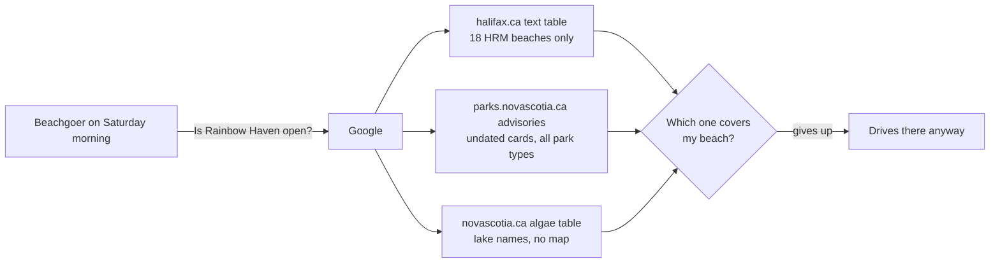

# Is the Beach Open: one map for Nova Scotia beach safety

### Problem to Solve

Nova Scotians cannot tell, in the moment, whether the beach they are about to drive to is safe to swim at. The information exists, but it is scattered across government pages that were never designed for a beachgoer on their phone.

- **HRM** tests its 18 supervised beaches for bacteria and posts a status (Open / Risk Advisory in Effect / Closed) on one text table on halifax.ca, updated by 8 a.m. on weekdays and 9 a.m. on weekends. Per the research doc, that page has no map, no location beyond a lake name, and no way to subscribe.
- **The province** posts park advisories as an undated wall of cards on parks.novascotia.ca where beach closures are mixed in with trail closures and boil-water notices, and posts blue-green algae bloom reports on a separate novascotia.ca page as a table of lake names with no coordinates.
- **Blue-green algae closures can happen at any time**, not on the morning schedule, and the toxins can make people sick and kill dogs. Per the hackathon briefing, "there really is no way to find out in real time what beaches are open or closed. You have to go searching everywhere for it."
- The only aggregator, Swim Guide, shows historical pass rates for most provincial beaches rather than today's status, and has no public data feed.

The result is that people either show up to a closed beach, or swim and let their dogs swim in water that is under an active advisory, because the warning was posted on a page nobody checks.



### What does business success look like, and how can we measure it?

Success is a public link the city could hand to residents tomorrow and walk away from. Two levers define done, one for the person using it and one for whether it keeps being right.

**A stranger answers "is my beach open?" in under 10 seconds.** A first-time user on a phone, from a cold load, with no login and no searching, sees the status of the beach they care about within 10 seconds. This is tested live in the demo by handing a judge the link and a beach name.

**The map stays correct with nobody touching it.** Every day for the rest of the season, the status shown for each beach matches what halifax.ca and the provincial pages say that day, including algae closures posted outside the morning schedule. Freshness is checked by spot-comparing the map against the source pages on a few mornings after launch.

Adoption (visitors and return visitors on a summer weekend) is worth tracking once the app is live in season, but the 2026 season ended before this build, so it is not part of the definition of done.

### Proposed Solution

A public, login-free web app that shows every government-monitored beach in Nova Scotia on one 3D map, coloured by today's official status, and refreshes itself from the source pages every hour without anyone maintaining it.

- **One map, both governments.** HRM's 18 supervised beaches and the province's 17 supervised park beaches appear together, so a user does not need to know which government runs their beach.
- **Status comes straight from the official pages.** HRM's daily table, the provincial advisory cards, and the provincial blue-green algae feed are pulled automatically and normalized to four states: Open, Advisory, Closed, Off-season. The app never invents a status, and every pin shows its source's exact words on tap.
- **Honest about what each pin means.** HRM beaches carry a daily tested status. Provincial beaches carry "advisory posted" or "no advisory posted," which is a weaker signal, and the pin is drawn differently to say so.
- **The map is the product.** Satellite imagery over 3D terrain, tilt and rotate, a globe-to-Halifax intro, and a fly-to on every search or tap. The same look at every beach in the province, from open-source sources with no keys or billing.
- **Phone first, with the answer on screen at load.** The nearest beaches and their status are listed the moment the map opens. On a wide screen the list docks to the side and the map stays uncovered.
- **Honest off-season, with a labelled replay.** In September the map is grey. A "Replay a day" control shows a past day under a banner that says so, which is both the demo's summer view and, once the app has collected its own snapshots, a real feature.
- **People on the sand can report a sign.** Reports appear beside the official status, never in place of it.

### Solution Details

#### Every beach a government tests is on the map, and nothing else is

The map carries 35 pins: the 18 beaches in HRM's supervised-beach table and the 17 beaches on the province's supervised-swimming page. Per the research doc, these are the only beaches in Nova Scotia where anyone samples the water, so they are the only beaches for which "open" or "closed" is a fact rather than a guess.

Beaches with no monitoring program (Crystal Crescent, Dingle, Lake Banook's public beach, and dozens of others) are deliberately absent. Showing them as "not monitored" would bury the 35 pins that carry real information.

#### Every pin speaks one of four words, and the source's exact words are one tap away

The two governments use different vocabularies, so the app normalizes them to a single four-state legend. The user reads one legend for the whole map, and tapping a pin shows the source's verbatim wording, the date it was posted, and a link to the government page it came from.

```task-artifact
/Users/eduardkakosyan/.humanlayer/workspaces/halifax-beach-safety-advisory-map-application-hk2d48/volta_hackathon/.humanlayer/tasks/halifax-beach-safety-advisory-map-application-hk2d48/mockup-status-vocabulary.html
```

The right-hand card in the mockup is the chosen design. How each source maps onto the four states:

| State | HRM beach (18) | Provincial beach (17) |
|---|---|---|
| **Open** (green) | Table says "Open" | No advisory card and no algae notice for this beach. Drawn as a **hollow green ring**, because "no advisory" is a weaker claim than "tested today" |
| **Advisory** (amber) | Table says "Risk Advisory in Effect" | An advisory card names this beach or park and its title does not say closed |
| **Closed** (red) | Table says "Closed" | An advisory card names this beach and says closed, **or** a blue-green algae notice names this beach's lake |
| **Off-season** (grey) | Table says "Supervision ended for the season" | Outside the July 1 to August 30 supervision window and no advisory is posted. Last in-season status is shown on tap |

Two rules keep this honest:

- **Algae means closed.** HRM's own protocol closes a beach immediately on a suspected bloom, so a provincial algae notice matching a beach's lake is treated the same way rather than downgraded to Advisory.
- **The app never shows a status it cannot source.** A pin's tap-through always names where its status came from. If a source page cannot be read on a given refresh, the pin keeps its last known status and the tap-through shows when it was last confirmed.

#### The map is the home screen, and the closest beaches are already listed when it loads

There is one screen. It opens straight onto a full-bleed map of Nova Scotia with all 35 pins coloured by status, no login, no landing page, no onboarding. A search box sits on top of the map and a bottom sheet lists the beaches closest to the user with their status chip. A user who knows their beach types its name; a user who doesn't reads the sheet. Either way the answer is on screen within one interaction.

```task-artifact
/Users/eduardkakosyan/.humanlayer/workspaces/halifax-beach-safety-advisory-map-application-hk2d48/volta_hackathon/.humanlayer/tasks/halifax-beach-safety-advisory-map-application-hk2d48/mockup-main-screen.html
```

The left-hand phone in the mockup is the chosen design. Its parts:

- **Search box** over the map, matching on beach name, lake name, or community ("Grand Lake" finds Oakfield Park Beach and Dollar Lake). Selecting a result flies the map to that pin and opens its detail.
- **Locate-me button** that centres the map on the user and sorts the sheet by distance. If location is declined, the sheet falls back to the Halifax region and the user can still search.
- **Bottom sheet "Closest to you"** showing the nearest beaches, each with its status dot, name, distance, and status chip. Dragging the sheet up expands it to the full list of 35 beaches grouped by region. Tapping a row or a pin opens that beach's detail.
- **Freshness footer** stating when each source was last read ("HRM updated today 8:02 a.m. · Province checked 9:40 a.m."). This is how the "still true on Monday" promise is visible to a user rather than an internal guarantee.

#### The map is 3D satellite terrain, and every beach in the province gets the same treatment

The map is a satellite image draped over real elevation, viewed at a tilt, with sky and fog at the horizon. The user can rotate and tilt it freely. The same look applies at every one of the 35 pins, whether it is downtown Halifax or Point Michaud in Cape Breton, because the imagery and terrain sources are province-wide rather than flown city by city.

```task-artifact
/Users/eduardkakosyan/.humanlayer/workspaces/halifax-beach-safety-advisory-map-application-hk2d48/volta_hackathon/.humanlayer/tasks/halifax-beach-safety-advisory-map-application-hk2d48/mockup-3d-map-live.html
```

The preview above is live and interactive; it is the intended look, not a sketch. The motion that makes it feel alive:

- **Globe intro.** On first load the map starts as a globe and flies down into a tilted view of the user's region (Halifax if location is unknown). This is the demo's opening shot.
- **Fly-to on every selection.** Searching a beach or tapping a row in the sheet flies the camera to that pin at a low, angled altitude rather than snapping. Moving between two beaches is a swoop, not a cut.
- **Pins stay upright and legible at any tilt.** Status dots are screen-anchored so a red pin reads as red whether the camera is overhead or near the horizon.

The imagery is Sentinel-2 satellite under a non-commercial licence, which suits a free public tool; the TDD should record attribution and note that a commercial imagery source would be needed if the app were ever sold.

#### Tapping a pin answers "can I swim, and what does that mean for me" without leaving the map

Tapping a pin or a sheet row flies the camera to the beach and opens a detail sheet over the map. The sheet leads with the status and the government's exact words, then answers the questions a beachgoer asks next.

```task-artifact
/Users/eduardkakosyan/.humanlayer/workspaces/halifax-beach-safety-advisory-map-application-hk2d48/volta_hackathon/.humanlayer/tasks/halifax-beach-safety-advisory-map-application-hk2d48/mockup-beach-detail.html
```

The right-hand phone in the mockup is the chosen design, top to bottom:

- **Header.** Beach name, lake or community, distance from the user, and the status chip.
- **Status block.** Who said it ("halifax.ca says"), their verbatim wording ("Risk Advisory in Effect"), when it was posted, a **plain-English line** translating the status into action ("Swimming is not recommended; keep dogs out of the water"), and a link to the source page. The plain-English line is the most important addition: the city's wording is for the city, this line is for a parent at the car door.
- **Facts.** Lifeguard dates and hours, water type and which bacterium is tested, and for HRM beaches the latest sample result next to the safe limit.
- **Last 14 days.** A strip of daily status colours so a user can see whether an advisory is new or has dragged on. Shown for HRM beaches only. Within the detail sheet, this is the row to cut first if the build runs short.
- **Actions.** Directions (opens the phone's maps app) and Share (copies a link straight to this beach).

Plain-English lines per state:

| State | Line |
|---|---|
| Open | "Tested and under the safe limit. Lifeguards on duty during posted hours." |
| Open (provincial, no advisory) | "No advisory posted by the province. Water is tested at this beach but results are not published." |
| Advisory | "Bacteria above the safe limit. Lifeguards are on site but not supervising swimming. Swimming is not recommended; keep dogs out of the water." |
| Closed | "Closed to swimming. Suspected blue-green algae, which can make people sick and kill dogs. Keep everyone out of the water." |
| Off-season | "No one is testing this beach right now. Last in-season status shown below." |

Provincial pins show fewer rows because the province publishes no sample results or per-beach lifeguard hours beyond the season-wide statement; the sheet simply omits what it cannot source rather than showing blanks.

#### Off-season the map is honestly grey, and a labelled "Replay a day" control shows what summer looks like

Between September and June every supervised beach reads "Supervision ended for the season," so the live map is 35 grey pins. The app shows exactly that rather than inventing colour, because the rule that no pin shows a status it cannot source applies in September too.

A **"Replay a day"** control on the map lets the user pick a past date and see the map as it stood that day. While replaying, a banner across the top of the map reads "Showing August 14, 2026 — not today's status" and the freshness footer is replaced by the replayed date, so a replayed map cannot be mistaken for a live one. Closing the banner returns to today.

- **At launch** the replay has one seeded day, August 14, 2026, reconstructed from HRM's status posts and the CBC and CTV coverage of that week, when two Halifax beaches were under advisory. This is the demo's "here is July" moment.
- **After launch** the app keeps its own daily snapshot of every pin, so by next summer a user can answer "what was Rainbow Haven like last weekend?" and the 14-day strip on the detail sheet fills from the same record.

```mermaid
flowchart LR
  L[Live map<br/>today's status] -->|"Replay a day" → pick date| R[Replay map<br/>banner: "Showing Aug 14, 2026"]
  R -->|close banner| L
  S[(Daily snapshots<br/>one per beach per day)] --> R
  S --> H[14-day strip on detail sheet]
```

#### People at the beach can report a sign, and their reports sit beside the official status, never in place of it

A closure sign at the gate can beat the government web page by hours, especially for algae closures that HRM posts "as needed." So the detail sheet has a **"Report a sign at this beach"** button. The user picks what the sign says (Closed, Advisory, or All clear), optionally adds a photo, and submits. No account is needed.

Reports never change a pin's colour. They appear as a separate line on the pin's detail sheet and as a small flag on the pin itself:

> ⚑ 2 people reported a **Closed** sign here today · last at 1:15 p.m.

The official status block stays exactly as sourced. A user seeing a green pin with a closure flag understands both facts at once: the city has not posted yet, and someone on the sand says otherwise. Reports expire from the pin at the end of the day they were made, so a stale report cannot linger into a new morning's official update.

This is the first feature to drop if build time runs short, because the map is complete without it.

#### The map is never more than an hour behind the government, and it says so

Every source (HRM's status table, the provincial advisory cards, and the provincial algae feed) is re-read once an hour, every day, with no one involved. The worst case is that a closure posted at 9:05 a.m. appears on the map at 10:00. The freshness footer on the home screen and the "posted" line on each detail sheet come from these reads, so a user always knows how current the map is.

When a source cannot be read on a given hour, nothing on the map changes silently:

- Every pin from that source keeps its last confirmed status.
- The footer switches from "HRM checked 9:40 a.m." to "HRM last confirmed 8:02 a.m. · couldn't reach halifax.ca since," so a quiet day and a broken feed look different.
- The detail sheet's "posted" line shows the last confirmed time rather than the current hour.

A user's own actions also refresh: opening the app or pulling down on the sheet re-reads the app's latest data, so a beachgoer never sees something older than the last hourly read.

#### Built for the phone first; on a wide screen the sheet becomes a side panel and the map is never covered

The phone is the primary target, because the moment of need is a person at the car door or on the sand. Every decision above is designed at phone width first. On a laptop or projector the same parts rearrange rather than change: search, the nearby list, the selected beach's detail, and the freshness footer move into a fixed left panel, and the 3D map fills the rest of the screen with the legend and "Replay a day" control floating over it.

```task-artifact
/Users/eduardkakosyan/.humanlayer/workspaces/halifax-beach-safety-advisory-map-application-hk2d48/volta_hackathon/.humanlayer/tasks/halifax-beach-safety-advisory-map-application-hk2d48/mockup-desktop.html
```

The lower screen in the mockup is the chosen wide layout. Nothing exists on desktop that does not exist on the phone; the panel is the bottom sheet, docked to the side. This is also the layout the judges see during the demo, so the map stays fully visible while the presenter clicks between beaches.

### Nice to have

- **Is it crowded right now?** A per-beach busyness signal, so a user choosing between two open beaches can pick the quieter one. No official source exists for this; the TDD should note candidate sources (for example popular-times style data or user check-ins) and it ships only if the core map is done.

### Out of Scope

- **Unmonitored beaches.** Beaches outside the two supervised rosters are not shown. Adding them as a "no data" layer is a possible follow-up once the monitored map is proven.
- **List-first home screen.** Considered and rejected. The map is the product and the demo; the bottom sheet gives the list-style read without hiding it.
- **Apple MapKit JS.** Ruled out: it has no tilt, terrain, or 3D buildings in the browser, and needs a paid developer membership.
- **Google photorealistic 3D tiles.** Ruled out for launch: the building mesh covers Halifax's core but not the rural provincial beaches, so the map would look worse at most pins, and it needs a billing account. Could be layered over downtown Halifax later as a stretch goal.
- **Crowd reports changing a pin's colour.** Rejected. A safety map that strangers can turn red is one prank from a bad headline, and nobody on the team is a moderator by Monday. Reports stay visibly separate from official status.
- **Alerts and subscriptions.** "Tell me when Rainbow Haven changes" is the natural next step and the gap the problem statement names, but it needs accounts or push permission and is not part of the 10-second promise. Follow-up once the map is live.
- **Native iOS or Android app.** The team ruled this out in the briefing because store publishing would not land by Monday. The web app is installable to the home screen, which covers the same need.
- **Accounts or login of any kind.** Nothing in the app requires knowing who the user is.

### Deferred to TDD

- Hosting is Vercel and the database is Supabase (decided; the TDD covers how the scrapers, storage, and refresh schedule are laid out on them).
- How the three government pages are read on a schedule given that halifax.ca and parks.novascotia.ca send no CORS header and filter user agents, and how the algae feed's lake names are matched to beaches.
- Where each beach's coordinates come from and how the differently spelled names across HRM, provincial, and geodata sources are reconciled into one list of 35.
- How the August 14, 2026 replay day is seeded, and the shape of the daily snapshot record that feeds replay and the 14-day strip.
- How photos on crowd reports are stored and how report spam is throttled without accounts.
- Attribution requirements for the Sentinel-2 imagery and terrain tiles, and the note that a commercial imagery source is needed if the app is ever sold.
