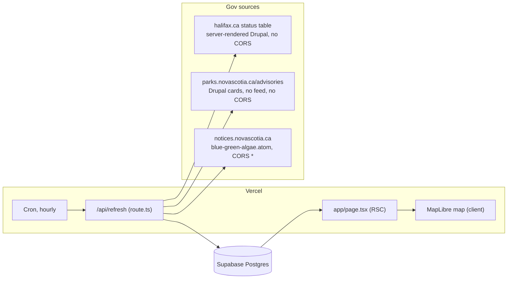
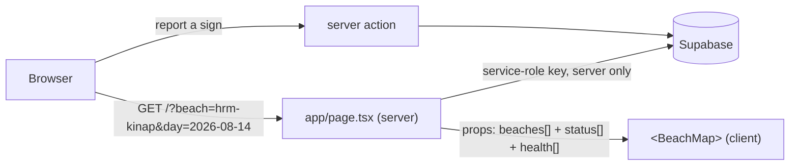

# Is the Beach Open: technical design

### System Design

#### The app is one Next.js deployment talking to Supabase; the scraper is a route handler on a schedule

The repository today holds `volta-frontend/`, a Vite + React SPA from a prior hackathon that renders a study-assistant dashboard from `src/data/mockData.ts`. It shares no domain with this project. It stays in the tree untouched; the beach app is a new Next.js App Router project at the repo root.

Everything runs in one Vercel project. Supabase is the only store, and no browser ever talks to a government site directly — halifax.ca and parks.novascotia.ca send no `Access-Control-Allow-Origin`, and halifax.ca returns 403 to non-browser user agents, so all three sources are read server-side with a browser `User-Agent`.



#### The season is over, so the sources are frozen and the build optimizes for that

It is September. All 18 rows of HRM's table read "Supervision ended for the season" with `Water Sample Results = N/A`, and the provincial supervision window closed August 30. Nothing on any source page will change until July.

This is the dominant design force. Anything that only earns its keep under churn — a raw-payload archive, fuzzy name matching, per-hour diffing — is not built. The ingest is as small as it can be while still being real: fetch, parse, resolve, upsert.

It also means the live map is 35 grey pins, and the demo runs on the seeded August 14, 2026 replay day. Replay is not a nice-to-have here; it is the only path that shows the app working.

#### Normalization happens on the way in, so the read path is a single select

The three sources speak three vocabularies. That collapse into the PRD's four states (Open / Advisory / Closed / Off-season) happens in `/api/refresh`, which writes one resolved row per beach. The page reads those rows and renders them; it applies no rules of its own.

```sql
beaches (           -- the 35-beach roster: hand-curated in the repo, upserted by refresh
  id            text primary key,      -- 'hrm-chocolate-lake'
  name          text not null,
  authority     text not null,         -- 'hrm' | 'province'
  lat           double precision not null,
  lon           double precision not null,
  ...
)

beach_status (      -- current resolved state, one row per beach
  beach_id          text primary key references beaches(id),
  state             text not null,     -- 'open' | 'advisory' | 'closed' | 'offseason'
  source_verbatim   text,              -- "Risk Advisory in Effect"
  source_url        text not null,
  source_posted_at  timestamptz,
  last_confirmed_at timestamptz not null   -- last successful read that produced this row
)

status_day (        -- one row per beach per day: feeds replay and the 14-day strip
  beach_id text references beaches(id),
  day      date,
  state    text not null,
  primary key (beach_id, day)
)

source_health (     -- exactly three rows: 'hrm', 'parks', 'algae'
  source          text primary key,
  last_attempt_at timestamptz not null,
  last_success_at timestamptz,
  last_error      text
)
```

Three properties the PRD asks for fall out of this shape directly:

- **A failed read changes nothing.** `last_confirmed_at` is only written by a read that succeeded, so a source that goes down leaves its pins on their last known status with an honest "last confirmed" timestamp, exactly as the PRD's degradation rule requires. Nothing has to reconstruct that from history.
- **A quiet day and a broken feed look different.** `source_health` separates "we tried" from "we succeeded", which is the whole difference between the footer reading *"HRM checked 9:40 a.m."* and *"HRM last confirmed 8:02 a.m. · couldn't reach halifax.ca since"*. Three rows carry the entire freshness footer.
- **The map is honest about provenance.** Every `beach_status` row carries the verbatim wording and the URL it came from, so a pin can never render a status it cannot attribute.

There is deliberately no raw-payload log alongside these tables. It would buy replayability of parsing decisions at the cost of 72 identical rows a day for ten months.

#### All curated data lives in the repo, and a scraped row finds its beach by exact alias or not at all

No source carries coordinates alongside status, and every source spells the same beach differently (*Cunard Pond Beach* in HRM's table, *CUNARD JUNIOR HIGH SCHOOL PARK BEACH* in the recreation layer). The algae feed never names a beach at all — it names lakes. So the roster is a TypeScript file, curated once from the research doc's geodata sources, and each entry carries the exact strings every source uses for it. The reconstructed August 14 replay day is a second file of the same kind.

```text
lib/seed/
  beaches.ts           # the 35-beach roster with coordinates and match aliases
  days/2026-08-14.ts   # { 'hrm-chocolate-lake': 'advisory', 'hrm-kinap': 'open', ... }
                       # header comment cites the HRM posts and CBC/CTV coverage it was built from
```

```ts
{
  id: 'hrm-oakfield-park',
  name: 'Oakfield Park Beach',
  authority: 'hrm',
  lat: 44.8875, lon: -63.5744,
  match: {
    hrmTable: 'Oakfield Park Beach',                    // exact cell text on halifax.ca
    lakes:    ['Shubenacadie Grand Lake', 'Grand Lake'], // exact <lake> strings from the atom feed
  },
}
```

Every refresh upserts both files before it touches a government site. Keys are natural (`beaches.id`, `(beach_id, day)`), so re-running is a no-op and the file in git is always the truth. A seeded day and a day the scraper recorded have the same shape in `status_day`, so the page never knows which it is rendering.

```text
refresh()
  upsert seed.beaches           -> beaches
  upsert seed.days[*]           -> status_day
  for each source: fetch, parse, match, resolve
  upsert resolved rows          -> beach_status
  upsert (beach_id, today)      -> status_day        # last-write-wins within the day
  update source_health
```

Matching is a dictionary lookup after trimming whitespace and case. **A name the dictionary doesn't know is logged and ignored, never guessed** — a fuzzy match that lands a Long Lake bloom on Long Pond Beach would be a safety bug with no error to catch. When halifax.ca does rename a row, the pin keeps its last confirmed status and someone adds one alias, which is the degradation path the PRD already designed for. Provincial advisory cards carry no park field, only a free-text title and body; they match on a `/park/<slug>` link in the body when one is present and on the lake-alias list otherwise — still exact, still ignore-if-unknown.

Today's `status_day` row is overwritten by each hourly run. A beach closed at 9 a.m. and reopened by 3 p.m. reads as open in the 14-day strip, which is what the government page would have shown at the end of that day.

#### An hourly Vercel cron is the only thing that triggers a scrape

```json
{ "crons": [{ "path": "/api/refresh", "schedule": "0 * * * *" }] }
```

Vercel invokes the route handler by GET on the production deployment and attaches `Authorization: Bearer $CRON_SECRET`, which the handler checks before doing any work. Hourly scheduling requires a Pro plan — Hobby rejects any sub-daily expression at deploy time — and the project is on Pro.

The PRD's other freshness clause, *"opening the app or pulling down on the sheet re-reads the app's latest data"*, is a caching decision rather than a second scrape path: the page reads Supabase per request instead of being statically cached, so a user always sees the most recent successful refresh. No user action ever reaches a government site.

#### The browser never holds a Supabase key; the page reads on the server and anything shareable is a URL

There is no login and nothing a user can read that isn't public, so the simplest safe arrangement is that only the server talks to Supabase. `app/page.tsx` runs on the server with the service-role key from a server-only env var, reads the roster, current status, and source health in one go, and hands the client map plain JSON. No RLS policies exist because no public credential can reach the tables.



The whole app is one page, and any state worth sharing is a search param the server reads:

- `?day=2026-08-14` renders from `status_day` rows for that date instead of `beach_status`; the banner and the replaced footer are driven by the param's presence. A replayed map is a shareable link, and closing the banner is navigating back to `/`.
- `?beach=hrm-kinap` renders with that beach's detail sheet open. *Share* on the sheet copies this URL, so a shared link lands on the answer, not the map.

Crowd reports are the one write path and go through a server action, which is also the only place any throttling or verification can live since the browser has nothing to authenticate with.

#### A report costs a human a Turnstile check, and no single person can put a flag on a pin

With no accounts, verification has to prove two cheaper things instead of identity: that a human submitted the report, and that one human can't submit it fifty times. Cloudflare Turnstile handles the first invisibly on the form; a per-IP count in Postgres handles the second. Raw IPs are never stored — only a salted hash.

```text
submitReport(beachId, sign, photo?, turnstileToken)
  POST challenges.cloudflare.com/turnstile/v0/siteverify   -> not success? reject
  ipHash = sha256(salt + x-forwarded-for)
  count reports where ip_hash = ipHash and beach_id = beachId
        and created_at > now() - 1 hour                    -> >= 1? reject 429
  upload photo to Storage bucket 'report-photos' (if any)
  insert reports row
```

```sql
reports (
  id         bigserial primary key,
  beach_id   text not null references beaches(id),
  sign       text not null,          -- 'closed' | 'advisory' | 'clear'
  ip_hash    text not null,
  photo_path text,                   -- object key in the private 'report-photos' bucket
  created_at timestamptz not null default now()
)
```

The flag on a pin — *"⚑ 2 people reported a Closed sign here today"* — only appears once **two or more reports from distinct `ip_hash` values agree on the same sign the same day**. A lone report is stored but not surfaced. Combined with the throttle, that means putting a flag on a pin takes two people at two addresses, which is roughly what it takes to be telling the truth. Phone OTP can be added at the same server action later if abuse shows up; nothing else would need to change.

#### The map is MapLibre over keyless satellite and terrain, exactly as the PRD's live mockup

The PRD's `mockup-3d-map-live.html` is the intended look and already fixes the sources. Nothing needs a key or a billing account; all three are attribution-only.

| Layer | Source | Licence / attribution |
|---|---|---|
| Satellite imagery | EOX Sentinel-2 cloudless 2020 WMTS (`tiles.maps.eox.at/wmts/1.0.0/s2cloudless-2020_3857/...`) | CC BY-NC-SA 4.0 — *"Sentinel-2 cloudless by EOX"*. Non-commercial only; a commercial imagery source is required if the app is ever sold |
| Terrain + hillshade | AWS Terrain Tiles, Terrarium PNG (`s3.amazonaws.com/elevation-tiles-prod/terrarium/...`) | Public domain / open data; unmaintained but live |
| Engine | MapLibre GL JS, globe projection, `setTerrain` at 1.6× exaggeration | BSD-3 |

There is no vector basemap or label layer over the imagery; the search box and the sheet are how a user finds a beach, and the pins are the only text on the map. Attribution is rendered by MapLibre's compact control.

#### The schema is SQL migration files in git, applied with the Supabase CLI

The five tables and the `report-photos` Storage bucket are declared once, as SQL under `supabase/migrations/`, and reach the hosted project through `supabase db push`. The same files drive `supabase start` for a local Postgres during development, so the schema in git is the only authored copy and a fresh project is one command away.

```text
supabase/
  config.toml
  migrations/
    20260912000000_init.sql   # beaches, beach_status, status_day, source_health, reports, bucket
```

### Program Design

#### Each source reports what it saw; one pure resolver turns readings into the four states

The PRD's status table has two very different halves. HRM is "read a cell, map a word." Provincial status is the *absence* of readings — no advisory card, no algae notice, inside the season — which no single scraper can observe. So scrapers never write status. Each returns a list of `SourceReading`s, and one resolver walks the full roster and decides every pin.

```text
lib/ingest/
├── sources/
│   ├── hrm.ts      fetch → parse table → SourceReading[]   (18, one per row)
│   ├── parks.ts    fetch → parse cards → SourceReading[]   (0..n, matched cards only)
│   └── algae.ts    fetch → parse atom  → SourceReading[]   (0..n, matched lakes only)
├── resolve.ts      (roster, readings, today) → BeachStatusRow[]   (always 35)
└── refresh.ts      seeds → sources → resolve → upsert → health
```

```ts
type SourceReading = {
  beachId:   string
  source:    'hrm' | 'parks' | 'algae'
  kind:      'open' | 'advisory' | 'closed' | 'offseason'   // the source's own claim
  verbatim:  string          // "Risk Advisory in Effect" / card title / lake name
  url:       string
  postedAt?: Date
}

resolve(roster: Beach[], readings: SourceReading[], ok: Set<Source>, today: Date): BeachStatusRow[]
```

`resolve.ts` is the only file that encodes the PRD's table — *algae beats everything*, *HRM's word maps one-to-one*, *a provincial beach with no readings is hollow-green open in season and grey outside it*. Sources know nothing about each other or about those rules.

Because "no reading" means *open* for a provincial beach, the resolver has to know which sources actually answered. A source that throws is absent from `readings` and from `ok`; the resolver then **omits** every beach that source is authoritative for (HRM beaches need `hrm`; provincial beaches need both `parks` and `algae`) instead of guessing. `refresh.ts` upserts only the rows that came back, so an omitted beach keeps its `last_confirmed_at` — the PRD's degradation rule, with no scraper aware it exists.

### Patterns to Follow
